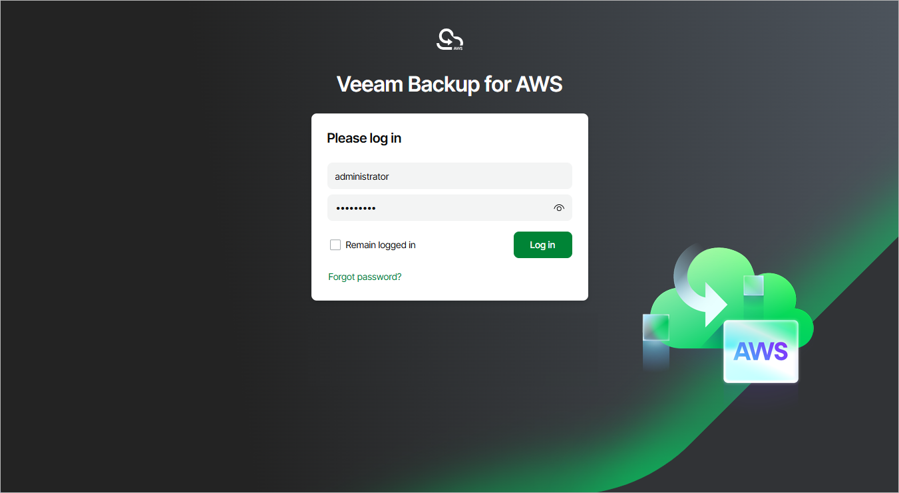
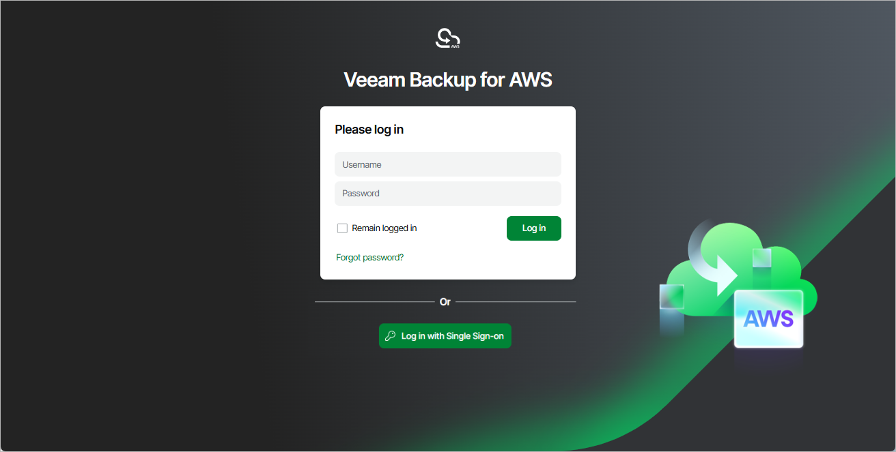

In this article

To access Veeam Backup for AWS, in a web browser, navigate to the Veeam Backup for AWS web address. The address consists of a public IPv4 address or DNS hostname of the backup appliance. Note that the website is available over HTTPS only.

|  |
| --- |
| Important |
| * If the backup appliance is deployed without a public IP address, you must establish a connection between the VPC of the appliance and your on-premises network to access Veeam Backup for AWS. For more information, see [Configuring Access to Backup Appliances in AWS](access_backup_appliances.md).  * Internet Explorer is not supported. To access Veeam Backup for AWS, use Microsoft Edge (latest version), Mozilla Firefox (latest version) or Google Chrome (latest version). |

You can access Veeam Backup for AWS using a local user account or a user account of an external identity provider. To learn how to add user accounts to Veeam Backup for AWS, see [Adding User Accounts](accounts_vba_users_create.md).

|  |
| --- |
| Note |
| The web browser may display a warning notifying that the connection is untrusted. To eliminate the warning, you can replace the TLS certificate that is currently used to secure traffic between the browser and the backup appliance with a trusted TLS certificate. To learn how to replace certificates, see [Replacing Security Certificates](certificates_settings.md). |

Logging In Using Local User Account

To log in using credentials of a Veeam Backup for AWS user account, do the following:

1. In the Username and Password fields, specify credentials of the user account.

If you log in for the first time, use credentials of the default user that was created after the product installation. In future, you can add other user accounts to grant access to Veeam Backup for AWS. For more information, see [Managing User Accounts](accounts_vba_users.md).

|  |
| --- |
| Tip |
| If you do not remember the user password, you can reset it. To do that, click the Forgot password? link and follow the instructions provided in [this Veeam KB article](https://www.veeam.com/kb3030). |

1. Select the Remain logged in check box to save the specified credentials in a persistent browser cookie so that you do not have to provide credentials every time you access Veeam Backup for AWS in a new browser session.

1. Click Log in.

If [multi-factor authentication (MFA) is enabled](accounts_vba_users_mfa.md) for the user, Veeam Backup for AWS will prompt you to enter a code to verify the user identity. In the Verification code field, enter the temporary six-digit code generated by the authentication application running on your trusted device. Then, click Log in.

Logging In Using Identity Provider User Account

|  |
| --- |
| Important |
| To access Veeam Backup for AWS under a user account of your identity provider, you must first [configure single sign-on settings](sso_settings.md) and then [add the identity provider user account](accounts_vba_users_create.md) to Veeam Backup for AWS. |

To log in using an identity provider, do the following:

1. Click Log in with Single Sign-On. You will be redirected to your identity provider portal.
2. If you have not logged in yet, log in to the identity provider portal. After that, you will be redirected to the Veeam Backup for AWS Overview page as an authorized user.

Logging Out

To log out, at the top right corner of the Veeam Backup for AWS window, click the user name and then click Log out.

Page updated 9/29/2025

Page content applies to build 10.0.0.232
