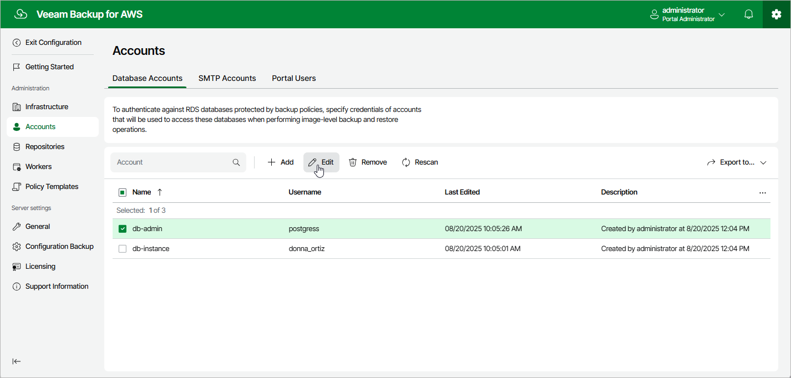

In this article

For each database account added to the Veeam Backup for AWS configuration database, you can modify settings configured while adding the account:

1. Switch to the Configuration page.

1. Navigate to Accounts > Database Accounts.

1. Select the account and click Edit.
2. Complete the Edit Account wizard.

1. To specify a new name and description for the account, follow the instructions provided in section [Adding Database Accounts](database_account_name.md) (step 2).
2. To modify the credentials that are used to access databases added to backup policies, follow the instructions provided in section [Adding Database Accounts](database_account_password.md) (step 3).
3. At the Summary step of the wizard, review summary information and click Finish to confirm the changes.

Page updated 8/20/2025

Page content applies to build 10.0.0.232
