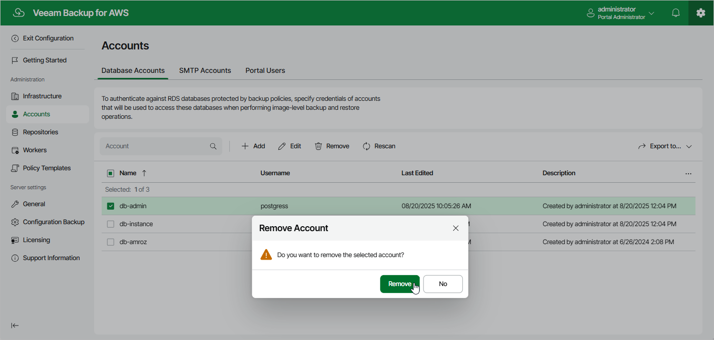

In this article

Veeam Backup for AWS allows you to permanently remove a database account from the configuration database if you no longer need it:

1. Switch to the Configuration page.
2. Navigate to Accounts > Database Accounts.
3. Select the account and click Remove.

|  |
| --- |
| Important |
| You cannot remove a database account that is associated with any backup policy. Delete all of the affected policies or [edit their settings](policies_edit.md) — and then try removing the account again. |

Page updated 8/20/2025

Page content applies to build 10.0.0.232
