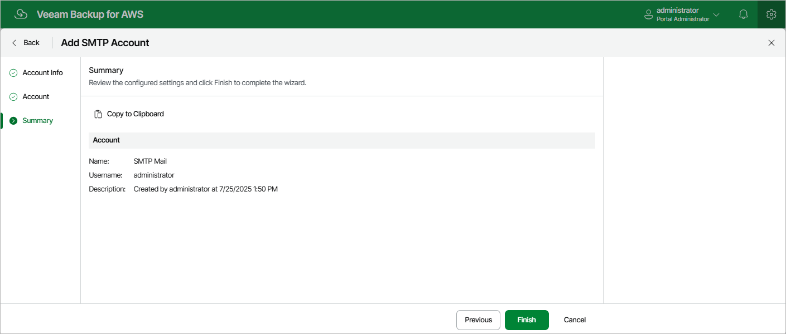

In this article

To add an account that will be used to connect to an SMTP server, do the following:

1. Switch to the Configuration page.
2. Navigate to Accounts > SMTP Accounts.
3. Click Add.

Complete the Add Account wizard.

1. At the Account Name step of the wizard, specify a name and description for the SMTP account. The name must be unique in Veeam Backup for AWS and the length of the name must not exceed 255 characters. The description length must not exceed 255 characters.
2. At the Account step of the wizard, specify credentials of a user account that has permissions to access the SMTP server. Veeam Backup for AWS will use the specified credentials to authenticate against the SMTP server.
3. At the Summary step of the wizard, review summary information and click Finish.

Page updated 7/25/2025

Page content applies to build 10.0.0.232
