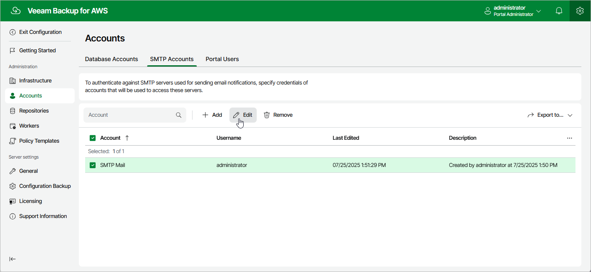

In this article

For each SMTP account, you can modify the settings configured while adding the account:

1. Switch to the Configuration page.
2. Navigate to Accounts > SMTP Accounts.
3. Select the check box next to the necessary SMTP account and click Edit.

Complete the Edit Account wizard.

1. To provide a new name and description for the account, follow the instructions provided in section [Adding SMTP Accounts](accounts_smtp_create.md) (step 3a).
2. To specify credentials of another user account to be used to authenticate against the SMTP server, follow the instructions provided in section [Adding SMTP Accounts](accounts_smtp_create.md) (step 3b).

Page updated 7/25/2025

Page content applies to build 10.0.0.232
