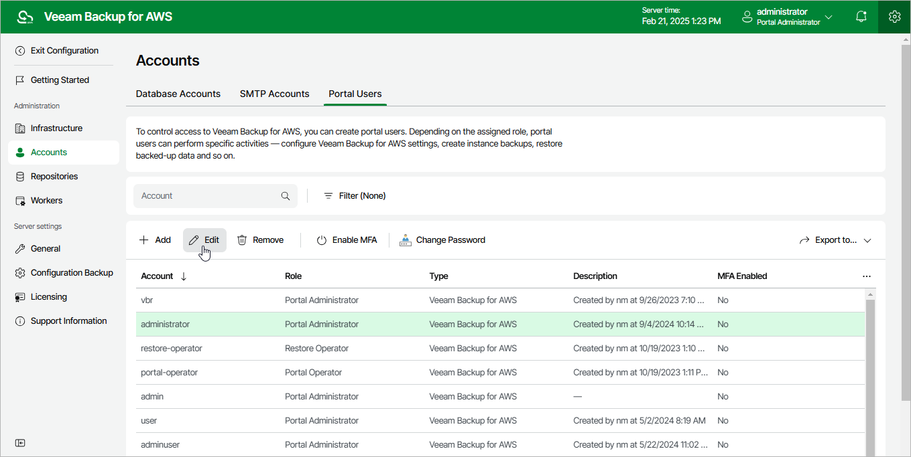

In this article

For each user account added to the Veeam Backup for AWS configuration database, you can modify settings configured while adding the account:

1. Switch to the Configuration page.

1. Navigate to Accounts > Portal Users.

1. Select the user account and click Edit.
2. Complete the Edit Account wizard.

1. To provide a new name and description for the user account, follow the instructions provided in section [Adding User Accounts](user_account_name.md) (step 3).
2. To choose a new role for the user account, follow the instructions provided in section [Adding User Accounts](user_account_role.md) (step 4).
3. At the Summary step of the wizard, review summary information and click Finish to confirm the changes.

Page updated 2/21/2025

Page content applies to build 10.0.0.232
