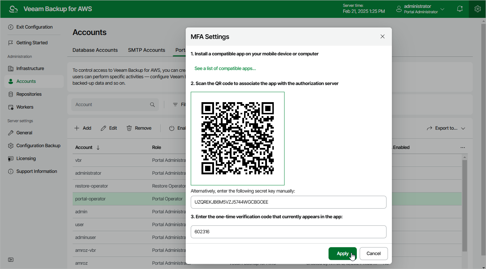

In this article

Multi-factor authentication (MFA) in Veeam Backup for AWS is based on the Time-based One-Time Password (TOTP) method that requires users to verify their identity by providing a temporary six-digit code sent by an authentication application to a trusted device.

To enable MFA for a user account, do the following:

1. Switch to the Configuration page.

1. Navigate to Accounts > Portal Users.

1. Select the user account and click Enable MFA.
2. Follow the instructions provided in the MFA Settings window:

1. Install an authentication application on a trusted device.

You can use any application that supports the TOTP protocol.

1. To associate the authentication application with the authorization server, scan the displayed QR code using the camera of the trusted device.
2. Enter a verification code generated by the authentication application.
3. Click Apply.

|  |
| --- |
| Important |
| * You cannot enable MFA for a user account whose user identity was obtained from an identity provider. * You cannot specify a user with multi-factor authentication (MFA) enabled while [adding the backup appliance to the backup infrastructure](connect_appliance.md). |

Page updated 4/30/2025

Page content applies to build 10.0.0.232
