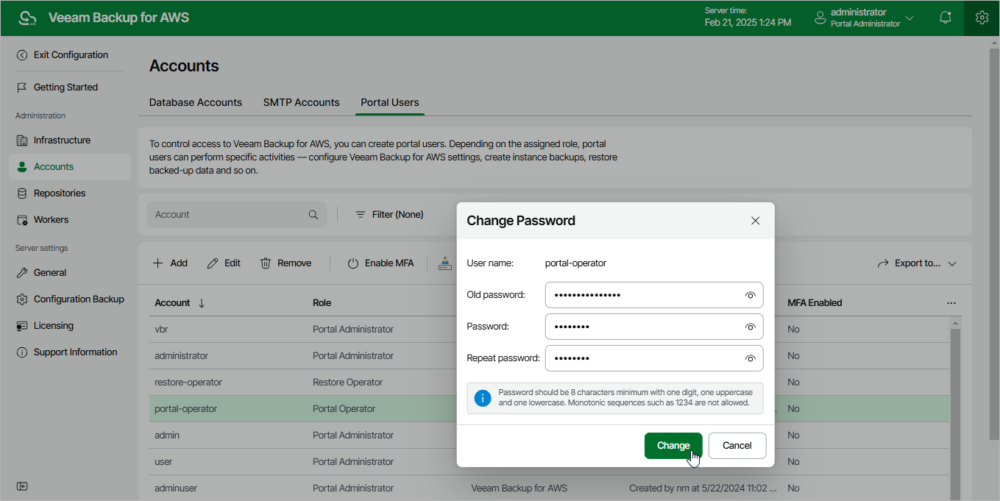

In this article

For Veeam Backup for AWS user accounts, you can change the password specified while creating the account:

|  |
| --- |
| Important |
| * You cannot change the password for a user account whose user identity was obtained from an identity provider.  * If your backup appliance is managed by a Veeam Backup & Replication server and you change the password of a user whose credentials Veeam Backup & Replication uses to connect to the backup appliance, you must also change this user password in the Veeam Backup & Replication console as described in the Veeam Backup & Replication User Guide, section [Editing and Deleting Credentials Records](https://helpcenter.veeam.com/docs/vbr/userguide/credentials_edit_delete.html?ver=13). Otherwise, the connection will not be established. |

1. Switch to the Configuration page.

1. Navigate to Accounts > Portal Users.

1. Select the user account and click Change Password.

1. In the Change Password window, enter the currently used password, enter and confirm a new password, and then click Change.

Page updated 8/8/2025

Page content applies to build 10.0.0.232
