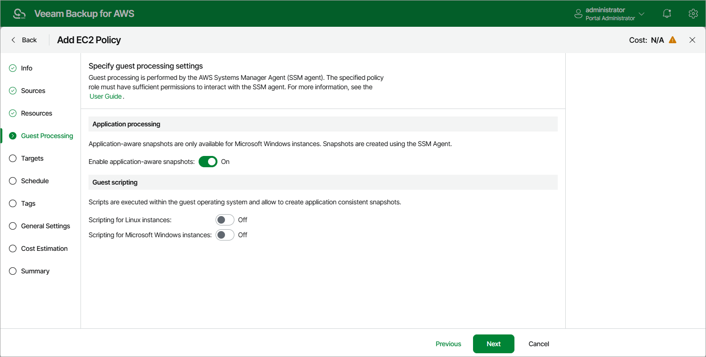

In this article

Veeam Backup for AWS takes transactionally consistent EC2 snapshots while no write operations occur on volume disks — to do that, it quiesces applications on the processed EC2 instances and creates a consistent view of application data. To enable application-aware processing, set the Enable application-aware snapshots toggle to On.

Limitations and Requirements for Application-Aware Processing

If you plan to instruct Veeam Backup for AWS to create transactionally consistent backups using application-aware processing, in addition to the [limitations and requirements for guest processing](add_policy_guest_processing.md#limitations), consider the following:

* Application-aware processing is available only for EC2 instances running Microsoft Windows Server 2008 R2 or later.
* To create application-aware snapshots, the VSS Guest Agent uses the VSS Copy Backup technology that does not support truncation of transaction logs. For more information on VSS backup, see [Microsoft Docs](https://learn.microsoft.com/en-us/windows/win32/vss/vss-backup-state).
* EC2 instances for which you plan to enable application-aware processing must meet the following prerequisites:

* The EC2 instances must have VSS components installed. To learn how to download and install VSS components, see [AWS Documentation](https://docs.aws.amazon.com/AWSEC2/latest/WindowsGuide/application-consistent-snapshots-getting-started.html#run-command-vss-package).
* The EC2 instances must have access to the [Amazon Elastic Compute Cloud (EC2)](https://docs.aws.amazon.com/general/latest/gr/ec2-service.html) service.
* To allow Veeam Backup for AWS to take VSS-enabled snapshots for the EC2 instances, the following permissions must be granted to the IAM roles attached to the instances:

|  |
| --- |
| {     "Version": "2012-10-17",     "Statement": [         {             "Effect": "Allow",             "Action": "ec2:CreateTags",             "Resource": [                 "arn:aws:ec2:\*::snapshot/\*"             ]         },         {             "Effect": "Allow",             "Action": [                 "ec2:DescribeInstances",                 "ec2:CreateSnapshot",                 "ec2:DescribeSnapshots"             ],             "Resource": "\*"         }     ]  } |

To learn how to create IAM roles for VSS-enabled snapshots and grant permissions to them, see [AWS Documentation](https://docs.aws.amazon.com/AWSEC2/latest/WindowsGuide/application-consistent-snapshots-getting-started.html#run-command-vss-role).

Page updated 10/29/2025

Page content applies to build 10.0.0.232
