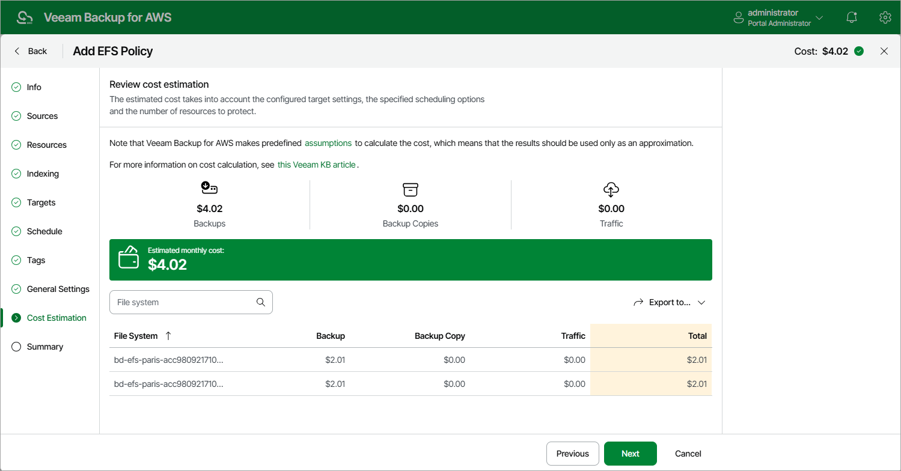

In this article

[This step applies only if you have created a schedule for the backup policy at the Schedule step of the wizard]

At the Cost Estimation step of the wizard, review the estimated monthly cost of AWS services and resources that will be consumed to protect the file systems added to the backup policy. The total estimated cost includes the following:

* The cost of creating backups of the EFS file systems.

For each file system included in the backup policy, Veeam Backup for AWS takes into account the number of restore points to be kept in the backup chain and the configured scheduling settings.

* The cost of creating backup copies and maintaining them in the target AWS Region.

For each file system included in the backup policy, Veeam Backup for AWS takes into account the number of restore points to be kept in the backup chain and the configured scheduling settings.

* The cost of sending API requests to Veeam Backup for AWS during data protection operations.

|  |
| --- |
| Note |
| To calculate the estimated cost, Veeam Backup for AWS uses the capabilities of the [AWS Pricing Calculator](https://calculator.aws/#/?key=new) that estimates the cost of services in USD only. This calculator is intended for informational and estimation purposes only. |

The estimated cost may occur to be significantly higher due to the backup frequency, cross-region data transfer and AWS backup charges. To reduce the cost, you can try the following workarounds:

* To reduce high AWS backup charges, adjust the backup retention settings to keep less restore points in the backup chain.
* To optimize the cost of storing backups, configure the scheduling settings to run the backup policy less frequently.

|  |
| --- |
| Tip |
| You can save the cost estimation as a .CSV or .XML file. To do that, click Export to and select the necessary format. |

Related Resources

[How AWS Pricing Works](https://docs.aws.amazon.com/whitepapers/latest/how-aws-pricing-works/welcome.html)

Page updated 9/26/2025

Page content applies to build 10.0.0.232
