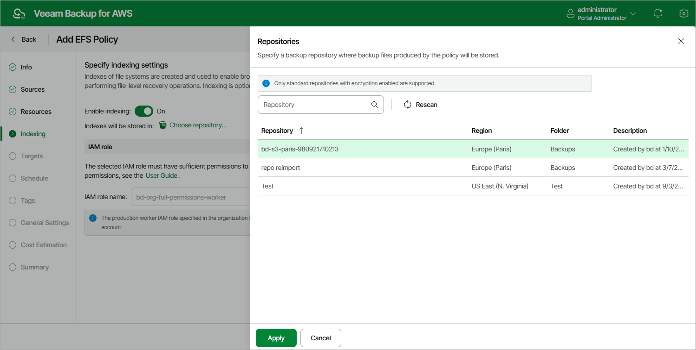

In this article

At the Indexing step of the wizard, you can instruct Veeam Backup for AWS to perform indexing of the processed EFS file systems. EFS indexing allows you to perform EFS file-level recovery operations without specifying the exact paths to the necessary files folders and to restore them using different restore points during one restore session. While performing EFS indexing of a file system, Veeam Backup for AWS creates a catalog of all files and directories (an index) and saves the index to a backup repository. This index is further used to reproduce the file system structure and to enable browsing and searching for specific files within an EFS backup.

To learn how indexing works, see [EFS Backup](backup_hiw_efs.md).

|  |
| --- |
| Note |
| To perform indexing of the EFS file systems, Veeam Backup for AWS deploys a worker instance per each processed file system in the same AWS account where the file system resides — production account. By default, the most appropriate network settings of AWS Regions are used to deploy these worker instances. However, you can add [specific worker configurations](worker_add_config_prod.md) that will be used to deploy worker instances used for EFS indexing operations. |

Limitations and Requirements

Before you enable EFS indexing, consider the following:

* EFS indexing is not supported in the Free edition of Veeam Backup for AWS. For more information, see [Licensing](licensing.md).
* Each processed EFS file system for which you want to perform indexing must meet the following requirements:

* A file system must have at least one mount target created.

* A mount target that will be used by worker instances to connect to the file system must be associated with a security group that allows inbound access on port 2049.

* If no specific [worker configurations](worker_add_config_prod.md) are added to Veeam Backup for AWS, the most appropriate network settings of AWS Regions are used to deploy worker instances for EFS indexing operations. For Veeam Backup for AWS to be able to deploy a worker instance used to create an index of a file system:

* A VPC network in which the file system has the mount target must have at least one security group that allows outbound access on ports 2049 and 443. These ports are used by worker instances to mount the file system and to communicate with [AWS services](system_requirements_aws_services.md).
* The DNS resolution option must be enabled for the VPC network. For more information, see [AWS Documentation](https://docs.aws.amazon.com/vpc/latest/userguide/working-with-vpcs.html#Create-VPC).
* As Veeam Backup for AWS uses public access to communicate with worker instances, the [public IPv4 addressing](https://docs.aws.amazon.com/vpc/latest/userguide/working-with-subnets.html#subnet-public-ip) attribute must be enabled at least for one subnet in the Availability Zone in which the file system has a mount target and the VPC network to which the subnet belongs must have an [internet gateway attached](https://docs.aws.amazon.com/vpc/latest/userguide/VPC_Internet_Gateway.html). VPC network and subnet route tables must have routes that direct internet-bound traffic to this internet gateway.

If you want worker instances to operate in a private network, enable the [private network deployment](enable_private_network_deployment.md) functionality and configure [specific VPC endpoints](configuring_private_networks.md) for the subnet to let Veeam Backup for AWS use private IPv4 addresses. Alternatively, configure VPC interface endpoints as described in section [Appendix C. Configuring Endpoints in AWS](configure_endpoints.md).

Enabling EFS Indexing

To enable indexing of the processed file systems, do the following:

1. Set the Enable indexing toggle to On.
2. In the Repositories window, select a repository where the created EFS indexes will be stored, and click Apply.

For a backup repository to be displayed in the list of available repositories, it must be added to Veeam Backup for AWS as described in section [Adding Backup Repositories Using Web UI](repositories_add_ui.md). The list shows only backup repositories of the S3 Standard storage class that have encryption enabled and immutability disabled.

1. Depending on the option selected at [step 3](add_policy_scope_efs.md) of the wizard, the following will happen:

* If you have selected the Account option, you will be able to choose an IAM role that will be attached to the worker instances and used by Veeam Backup for AWS to communicate with these instances. The role you choose must belong to the same account to which the IAM role specified for the backup operation belongs, and must be assigned the permissions listed in section [Worker Deployment Role Permissions in Production Accounts](role_permissions_prod_acc.md#worker_reqs).

For an IAM role to be displayed in the list of available roles, it must be added to Veeam Backup for AWS with the Production worker role selected as described in section [Adding IAM Roles](https://helpcenter.veeam.com/docs/vbaws/guide/iam_roles_add.html). The list shows only IAM roles that belong to the production account — account to which the file systems belong. Note that the specified IAM role must be included in one or more instance profiles. For more information on instance profiles, see [AWS Documentation](https://docs.aws.amazon.com/IAM/latest/UserGuide/id_roles_use_switch-role-ec2_instance-profiles.html).

* If you have selected the Organization option, Veeam Backup for AWS will automatically choose an IAM role that will be attached to the worker instances and used by Veeam Backup for AWS to communicate with these instances. It will be one of the roles specified in the settings of the selected organization identity — either the IAM role whose permissions will be used to perform the backup operation (that is, the Production worker IAM role), or the IAM role that will be attached to the worker instances and used by Veeam Backup for AWS to communicate with these instances (that is, the Backup and restore IAM role).

For Veeam Backup for AWS to be able to choose an IAM role automatically, it must be created in all AWS accounts belonging to the selected organization identity, and specified in the organization settings as described in section [Adding AWS Organizations](organization_add_settings.md#backup_role) (step 3).

|  |
| --- |
| Important |
| If you select the Account option, it is recommended that you check whether both the IAM role specified at [step 3](add_policy_scope_efs.md#account) of the wizard and the IAM role specified in the Backups section have the required permissions. If some permissions of the IAM role are missing, the backup policy may fail to complete successfully. To run the IAM role permission check, click Check Permissions and follow the instructions provided in section [Checking IAM Role Permissions](iam_roles_check.md#wizard). |

Page updated 9/26/2025

Page content applies to build 10.0.0.232
