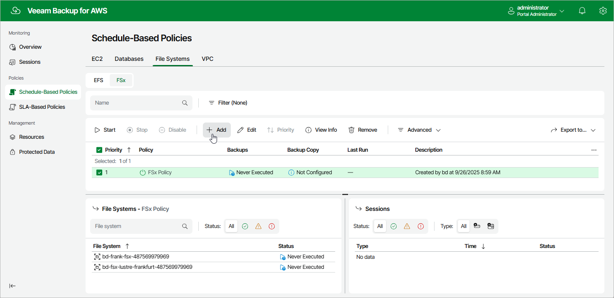

In this article

To launch the Add FSx Policy wizard, do the following:

1. Navigate to Schedule-Based Policies > File Systems > FSx.
2. Click Add.

Page updated 1/13/2026

Page content applies to build 10.0.0.232
