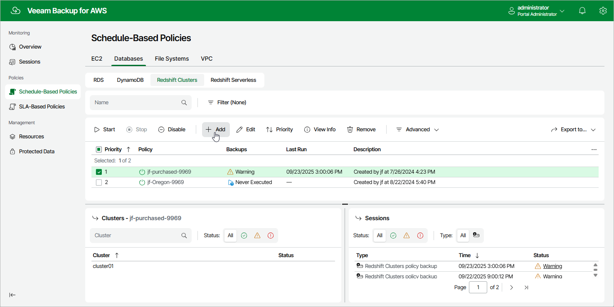

In this article

To launch the Add Redshift Policy wizard, do the following:

1. Navigate to Schedule-Based Policies > Databases > Redshift.
2. Click Add.

Page updated 1/13/2026

Page content applies to build 10.0.0.232
