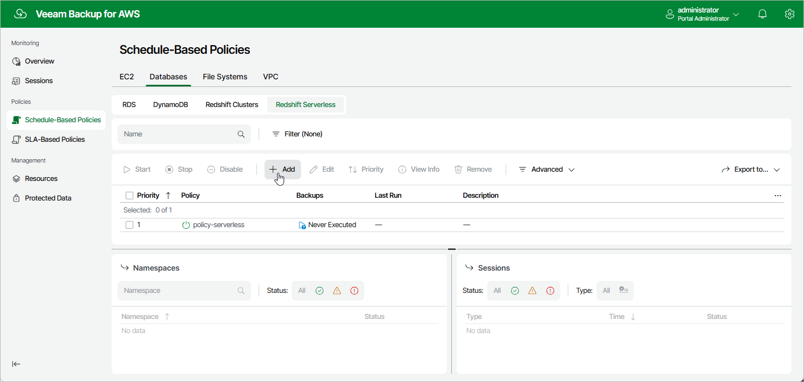

# Step 1. Launch Add Redshift Serverless Policy Wizard

To launch the Add Redshift Serverless Policy wizard, do the following:

1. Navigate to Schedule-Based Policies > Databases > Redshift Serverless.
2. Click Add.

