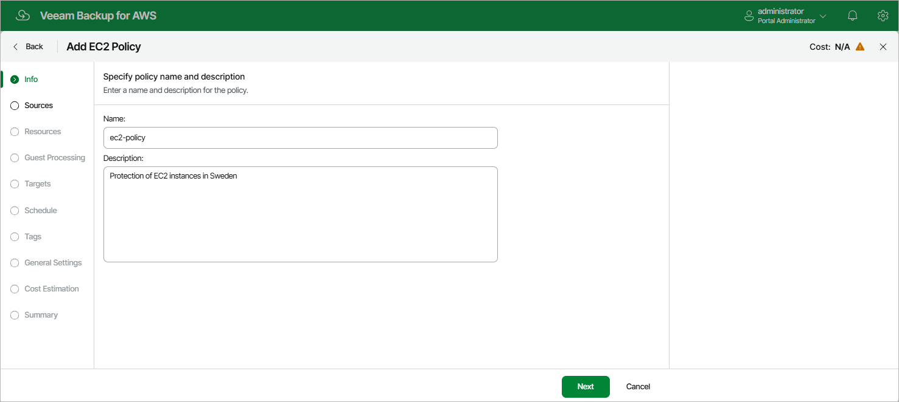

# Step 2. Specify Policy Name and Description

At the Info step of the wizard, use the Name and Description fields to specify a name for the new backup policy and to provide a description for future reference. The name must be unique in Veeam Backup for AWS; the maximum length of the name is 127 characters, the maximum length of the description is 255 characters.

