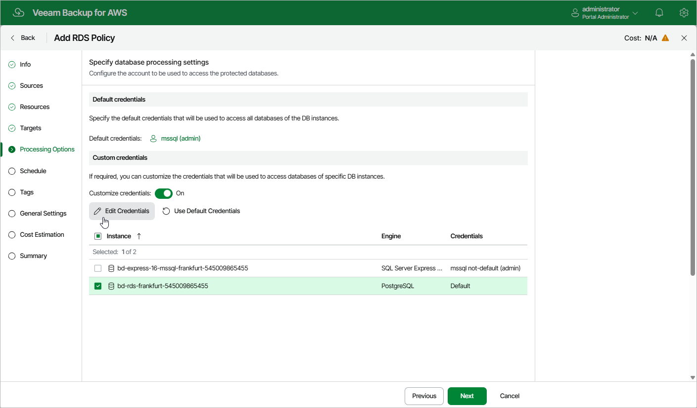

In this article

[This step applies only if you have enabled image-level backups at the Targets step of the wizard]

At the Processing Options step of the wizard, select a database account whose credentials will be used to authenticate against databases of the DB instances added to the backup scope. For an account to be displayed in the list of available accounts, it must be added to Veeam Backup for AWS as described in section [Adding Database Accounts](accounts_database_create.md). If you have not added the necessary account to Veeam Backup for AWS beforehand, you can do it without closing the Add RDS Policy wizard. To do that, click Add and complete the Add Account wizard.

By default, the selected account will be used to access all databases of the DB instances added to the backup policy. You can also granularly specify credentials that Veeam Backup for AWS will use to access databases of specific DB instances. To do that, set the Customize credentials toggle to On, choose a DB instance for which you want to specify the credentials and click Edit Credentials.

|  |
| --- |
| Important |
| For Veeam Backup for AWS to be able to protect DB instances added to the backup policy, the selected account must exist on these instances. |

Page updated 7/30/2025

Page content applies to build 10.0.0.232
