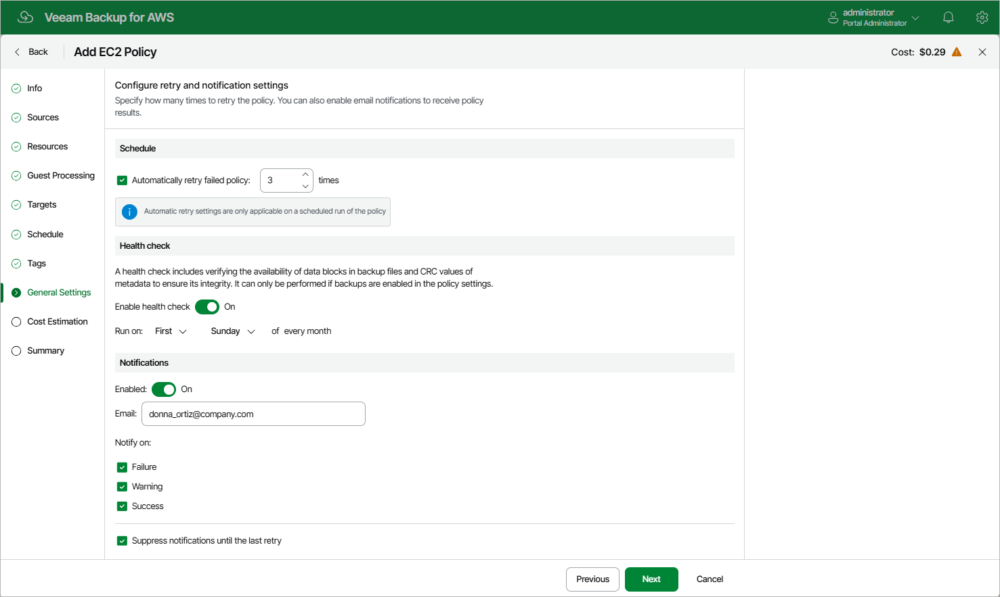

In this article

At the General Settings step of the wizard, you can enable automatic retries, schedule health checks and specify notification settings for the backup policy.

Automatic Retry Settings

To instruct Veeam Backup for AWS to run the backup policy again if it fails on the first try, do the following:

1. In the Schedule section of the step, select the Automatically retry failed policy check box.
2. In the field to the right of the check box, specify the maximum number of attempts to run the backup policy. The time interval between retries is 60 seconds.

When retrying backup policies, Veeam Backup for AWS processes only those instances that failed to be backed up during the previous attempt.

Health Check Settings

If you have enabled creation of image-level backups at [step 6](add_policy_target_settings_backups.md) of the wizard, you can instruct Veeam Backup for AWS to periodically perform a health check for backup restore points created by the policy. During the health check, Veeam Backup for AWS performs an availability check for data blocks in the whole standard backup chain, and a cyclic redundancy check (CRC) for storage metadata to verify its integrity. The health check helps you ensure that the restore points are consistent and that you will be able to restore data using these restore points. For more information on the health check, see [How Health Check Works](how_health_check_works.md).

|  |
| --- |
| Note |
| During a health check, Veeam Backup for AWS does not verify archived restore points created by the policy. |

To enable health checks for the backup policy, do the following:

1. In the Health check section of the step, set the Enable health check toggle to On.
2. Use the Run on drop-down lists to schedule a specific day for the health check to run.

|  |
| --- |
| Note |
| Veeam Backup for AWS performs the health check during the first policy session that runs on the day when the health check is scheduled. If another backup policy session runs on the same day, Veeam Backup for AWS will not perform the health check during that session. For example, if the backup policy is scheduled to run multiple times on Saturday, and the health check is also scheduled to run on Saturday, the health check will only be performed during the first policy session on Saturday. |

Notification Settings

|  |
| --- |
| Note |
| To be able to specify email notification settings for the EC2 Backup policy, you must configure [global notification settings](email_settings.md) first. |

To instruct Veeam Backup for AWS to send email notifications for the backup policy, do the following:

1. In the Notifications section of the step, set the Enabled toggle to On.

If you set the toggle to Off, Veeam Backup for AWS will send notifications according to the configured global notification settings.

1. In the Email field, specify an email address of a recipient.

Use a semicolon to separate multiple recipient addresses. Do not use spaces after semicolons between the specified email addresses.

1. Use the Notify on list to choose whether you want Veeam Backup for AWS to send email notifications in case the backup policy completes successfully, completes with warnings or completes with errors.

1. Select the Suppress notifications until the last retry check box to receive a notification about the final backup policy result.

If you do not select the check box, Veeam Backup for AWS will send a notification for every backup policy retry.

|  |
| --- |
| Note |
| If you specify the same email recipient in both backup policy notification and [global notification settings](email_settings.md), Veeam Backup for AWS will override the configured global notification settings and will send each notification to this recipient only once to avoid notification duplicates. |

Page updated 11/21/2025

Page content applies to build 10.0.0.232
