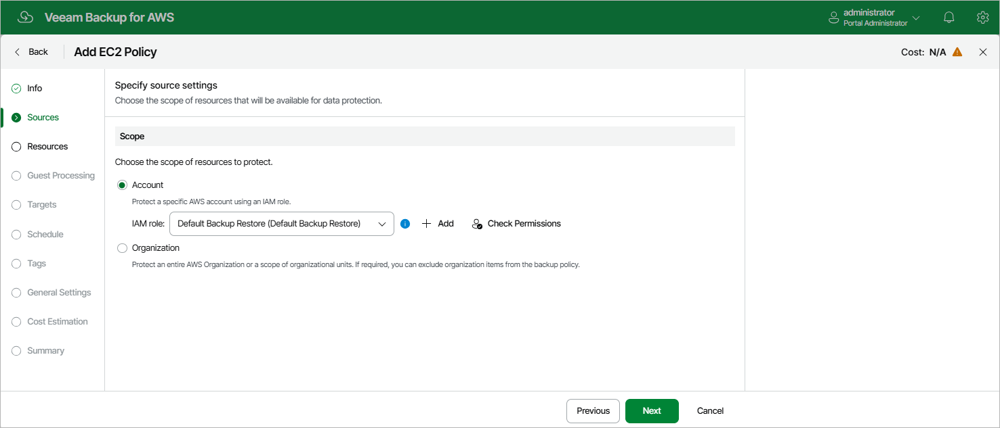

In this article

At the Sources step of the wizard, define the scope of resources that will be available for data protection:

* Select the Account option if you want to back up EC2 instances belonging to a single AWS account. Then, specify an IAM role whose permissions will be used to access AWS services and resources, and to create cloud-native snapshots of EC2 instances. The role you specify must belong to an AWS account in which the resources that you want to protect reside, and must be assigned the permissions listed in section [EC2 Backup IAM Role Permissions](role_permissions_backup_ec2.md).

For an IAM role to be displayed in the list of available roles, it must be added to Veeam Backup for AWS with the Amazon EC2 Backup operation selected for the role as described in section [Adding IAM Roles](iam_roles_specify_permissions.md). If you have not added the necessary IAM role to Veeam Backup for AWS beforehand, you can do it without closing the Add EC2 Policy wizard. To do that, click Add and complete the Add IAM Role wizard.

* Select the Organization option if you want to back up EC2 instances within an AWS Organization. Then, use the Organization drop-down list to specify the source organization identity — select an entire organization or a scope of organizational units whose resources Veeam Backup for AWS will back up.

For an AWS Organization or a scope of organizational units to be displayed in the list of available identities, it must be added to Veeam Backup for AWS as described in section [Adding AWS Organizations](organizations_add.md).

|  |
| --- |
| Important |
| * If you select the Account option, it is recommended that you check whether the selected IAM role has all the permissions required to perform the operation. If some permissions of the IAM role are missing, the backup policy may fail to complete successfully. To run the IAM role permission check, click Check Permissions and follow the instructions provided in section [Checking IAM Role Permissions](iam_roles_check.md#wizard). * If you select the Organization option, it is recommended that you instruct Veeam Backup for AWS to deploy worker instances in a production account. Since the Amazon EC2 service limits the maximum number of vCPUs that can be provisioned to worker instances deployed in each AWS account and AWS Region, Veeam Backup for AWS may not be able to deploy worker instances in the backup account in case the service quotas are exceeded. To learn how to deploy worker instances in a production account, see [Configuring Image-Level Backup Settings](add_policy_target_settings_backups.md#workers). |

Excluding Items from Data Protection Scope

If you select the Organization option, you can exclude specific organizational units and AWS accounts from the data protection scope; however, keep in mind that all nested units and accounts belonging to the excluded organizational unit will also be omitted from the scope. To do that, click Choose AWS items to exclude in the Exclusions section and do the following in Specify organization items to exclude window:

1. Use the Type drop-down list to choose whether you want to exclude organizational units or accounts from the data protection scope.
2. Use the Name or ID drop-down list to find the necessary organizational unit or account, and then click Exclude to exclude it from the data protection scope.

For an organizational unit or account to be displayed in the list of available items, it must be part of the source organization identity, and must be included in the scope of organizational units added to Veeam Backup for AWS, as described in section [Adding AWS Organizations](organization_add_scope.md) (step 4).

1. To save changes made to the backup policy settings, click Apply.

|  |
| --- |
| Tip |
| You can simultaneously exclude multiple items from the data protection scope. To do that, click Browse to select specific AWS items from the global list, select check boxes next to the necessary organizational units or AWS accounts in the list of available items, and then click Exclude.  If the list does not show the items that you want to exclude, click Rescan to launch the data collection process. As soon as the process is over, Veeam Backup for AWS will update the item list. |

Related Topics

[IAM Roles](accounts_iam_roles.md)

Page updated 9/22/2025

Page content applies to build 10.0.0.232
