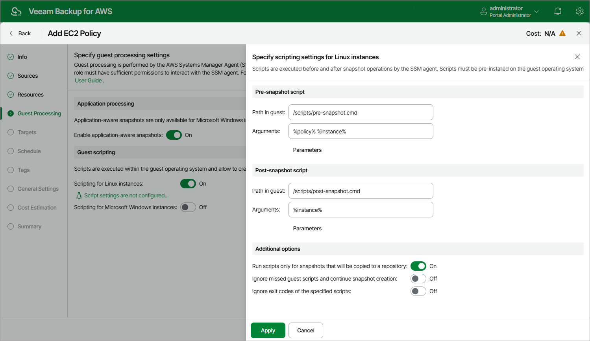

In this article

Before you enable guest scripting for processed EC2 instances, check [limitations and requirements](#limitations).

To enable guest scripting, at the Guest Processing step of the wizard, do the following

* For EC2 instances running Linux OS, set the Scripting for Linux instances toggle to On.

The Specify scripting settings for Linux instances window will open.

* For EC2 instances running Microsoft Windows OS, set the Scripting for Microsoft Windows instances toggle to On.

The Specify scripting settings for Microsoft Windows instances window will open.

In the opened window, specify pre-snapshot and post-snapshot scripts that you want to be executed before and after the backup operation:

1. In the Pre-snapshot script section, do the following:

1. In the Path in guest field, specify a path to the pre-snapshot script file on an EC2 instance.
2. In the Arguments field, specify additional arguments that must be passed to the script when the script is executed.

You can use runtime variables as arguments for the script. To see the list of available variables, click Parameters.

|  |
| --- |
| Note |
| Veeam Backup for AWS will run the script from the specified directory for all EC2 instances added to the backup policy. If you want to execute different scripts for different EC2 instances, ensure that script files uploaded to these instances are located under the same path and have the same name. |

1. Repeat step 1 for post-snapshot scripts in the Post-snapshot script section.
2. In the Additional options section, choose whether you want to instruct Veeam Backup for AWS to:

* Run scripts only while taking snapshot that will be used to create an image-level backup.
* Proceed with snapshot creation even though scripts are missing on some of the processed instances.
* Ignore exit codes returned while executing the scripts.

1. To save changes made to the backup policy settings, click Apply.

Limitations and Requirements for Guest Scripting

If you plan to instruct Veeam Backup for AWS to run custom scripts on the processed EC2 instances, in addition to the [limitations and requirements for guest processing](add_policy_guest_processing.md#limitations), consider the following:

* Scripts must be created beforehand.
* For EC2 instances running Microsoft Windows OS, Veeam Backup for AWS supports scripts in the EXE, BAT, CMD, WSF, JS, VBS and PS1 file formats.
* For EC2 instances running Linux OS, Veeam Backup for AWS supports scripts in the SH file format.

* IAM instance profiles used to grant permissions for SSM to interact with the processed EC2 instances must be created beforehand and attached to these instances. To learn how to create IAM instance profiles for AWS Systems Manager, see [AWS Documentation](https://docs.aws.amazon.com/systems-manager/latest/userguide/setup-instance-profile.html).

Page updated 10/8/2025

Page content applies to build 10.0.0.232
