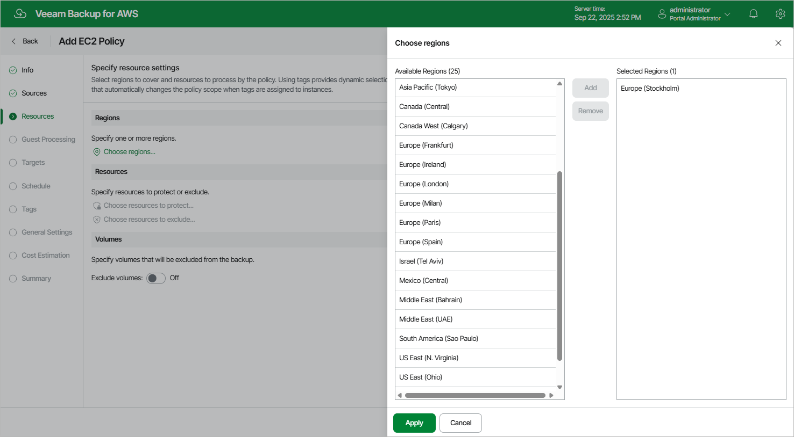
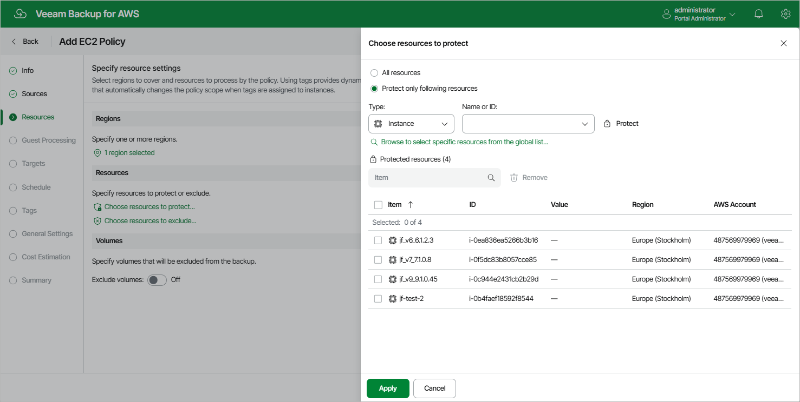
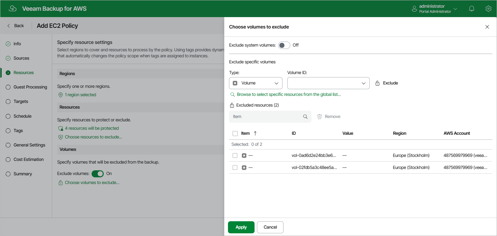

In this article

At the Resources step of the wizard, select AWS Regions where EC2 instances that you plan to back up reside, choose EC2 instances to back up, and specify EBS volumes of the selected EC2 instances to exclude from the backup policy.

Step 4a. Select AWS Regions

In the Regions section of the Resources step of the wizard, select AWS Regions where EC2 instances that you plan to back up reside:

1. Click Choose regions.
2. In the Choose regions window, select the necessary AWS Regions from the Available Regions list, and click Add.

The list of available regions will depend on the option selected at [step 3](add_policy_scope.md) of the wizard. If you have selected the Organization option, the list will contain all existing AWS Regions; if you have selected the Account option, the list will contain all AWS Regions enabled for the AWS account.

1. To save changes made to the backup policy settings, click Apply.

Step 4b. Select EC2 Instances

In the Resources section of the Resources step of the wizard, specify the backup scope — select EC2 instances that Veeam Backup for AWS will back up:

1. Click Choose resources to protect.
2. In the Choose resource to protect window, choose whether you want to back up all EC2 instances from AWS Regions selected at [step 4a](#regions) of the wizard, or only specific EC2 instances.

If you select the All resources option, Veeam Backup for AWS will regularly check for new EC2 instances launched in the selected regions and automatically update the backup policy settings to include these instances into the backup scope.

If you select the Protect only following resources option, you must also specify the resources explicitly:

1. Use the Type drop-down list to choose whether you want to add individual EC2 instances or AWS tags to the backup scope.

If you select the Tag option, Veeam Backup for AWS will back up only those EC2 instances that have specific tags and reside in the selected regions.

1. Use the Name or ID drop-down list to find the necessary resource, and then click Protect to add the resource to the backup scope.

For a resource to be displayed in the list of available resources, it must reside in an AWS Region that has ever been specified in any backup policy. Otherwise, the only option to discover the available resources is to click Browse to select specific resources from the global list and to wait for Veeam Backup for AWS to populate the resource list.

|  |
| --- |
| Tip |
| You can simultaneously add multiple resources to the backup scope. To do that, click Browse to select specific resources from the global list, select check boxes next to the necessary EC2 instances or AWS tags in the list of available resources, and then click Protect.  If the list does not show the resources that you want to back up, click Rescan to launch the data collection process. As soon as the process is over, Veeam Backup for AWS will update the resource list. |

If you add an AWS tag to the backup scope, Veeam Backup for AWS will regularly check for new EC2 instances assigned the added AWS tag and automatically update the backup policy settings to include these instances in the scope. However, this applies only to EC2 instances from the AWS Regions selected at [step 4a](#instances) of the wizard. If you select a tag assigned to EC2 instances from other regions, these instances will not be protected by the backup policy. To work around the issue, either go back to step 4a and add the missing regions, or create a new backup policy.

1. To save changes made to the backup policy settings, click Apply.

|  |
| --- |
| Tip |
| As an alternative to selecting the Protect only following resources option and specifying the resources explicitly, you can select the All resources option and exclude a number of resources from the backup scope. To do that, click Choose resources to exclude and specify the instances or tags that you do not want to protect — the procedure is the same as described for including resources in the backup scope.  Note that if a resource appears both in the list of included and excluded resources, Veeam Backup for AWS will still not process the resource because the list of excluded resources has a higher priority. |

Step 4c. Select EBS Volumes

In the Volumes section of the Resources step of the wizard, you can exclude from processing EBS volumes attached to the selected EC2 instances:

1. Set the Exclude volumes toggle to On.
2. In the Choose volumes to exclude window, choose whether you want to exclude system volumes of the selected EC2 instances from processing.
3. To exclude specific EBS volumes, specify the EBS volumes explicitly:

1. Use the Type list to choose whether you want to exclude individual EBS volumes or AWS tags from the backup scope.

If you select the Tag option, Veeam Backup for AWS will exclude from processing only those EBS volumes that have specific tags and reside in the selected regions.

1. Use the Name or ID drop-down list to find the necessary resource, and then click Exclude to exclude the resource from the backup scope.

For a resource to be displayed in the list of available resources, it must reside in an AWS Region that has ever been specified in any backup policy. Otherwise, the only option to discover the resources is to click Browse to select specific resources from the global list and to wait for Veeam Backup for AWS to rescan the region and to populate the resource list.

|  |
| --- |
| Tip |
| You can simultaneously exclude multiple resources from the backup scope. To do that, click Browse to select specific resources from the global list, select check boxes next to the necessary EBS volumes or AWS tags in the list of available resources, and then click Exclude.  If the list does not show the resources that you want to exclude, click Rescan to launch the data collection process. As soon as the process is over, Veeam Backup for AWS will update the resource list. |

If you exclude an AWS tag from the backup scope, Veeam Backup for AWS will regularly check for new EBS volumes assigned the excluded AWS tag and automatically update the backup policy settings to exclude these volumes from the scope.

1. To save changes made to the backup policy settings, click Apply.

|  |
| --- |
| Important |
| For Windows EC2 instances running VSS-aware applications, it is recommended that you do not exclude specific volumes other than system (root) volumes, since there is a limitation on the AWS System Manager side — only system volumes can be excluded. For more information on creating VSS snapshots, see [AWS Documentation](https://docs.aws.amazon.com/AWSEC2/latest/WindowsGuide/create-vss-snapshots-ssm.html). |

Page updated 1/8/2026

Page content applies to build 10.0.0.232
