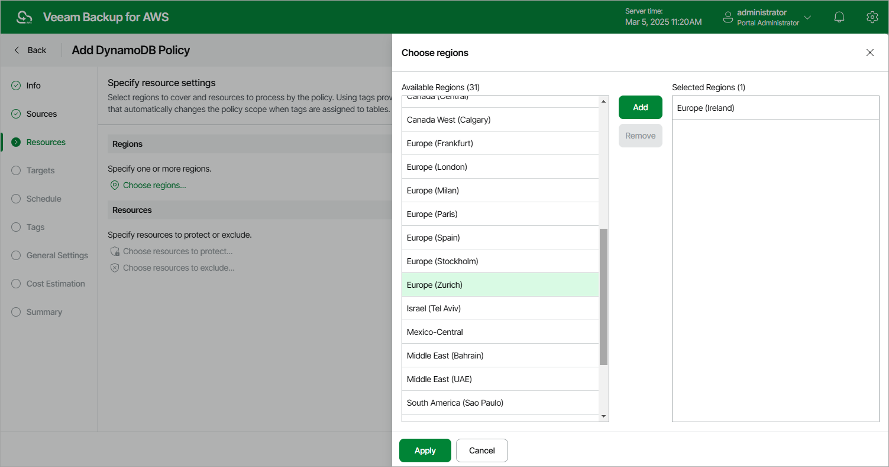
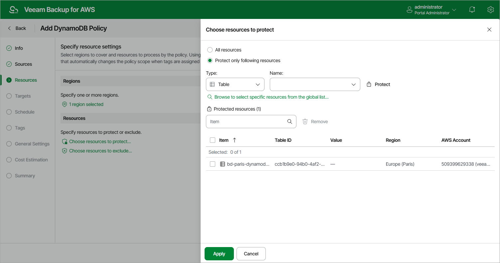

In this article

At the Resources step of the wizard, select AWS Regions where DynamoDB tables that you plan to back up reside and choose tables to back up.

Step 4a. Select AWS Regions

In the Regions section of the Resources step of the wizard, choose AWS Regions where DynamoDB tables that you plan to back up reside:

1. Click Choose regions.
2. In the Choose regions window, select the necessary regions from the Available Regions list, and then click Add.

The list of available regions will depend on the option you have selected at [step 3](add_policy_scope_dynamo.md) of the wizard. If you have selected the Organization option, the list will contain all existing AWS Regions; if you have selected the Account option, the list will contain all AWS Regions enabled for the AWS account.

1. To save changes made to the backup policy settings, click Apply.

Step 4b. Select DynamoDB Tables

In the Resources section of the Resources step of the wizard, specify the backup scope — select DynamoDB tables that Veeam Backup for AWS will back up:

1. Click Choose resources to protect.
2. In the Choose resources to protect window, choose whether you want to back up all DynamoDB tables from the selected AWS Regions or only specific DynamoDB tables.

If you select the All resources option, Veeam Backup for AWS will regularly check for new DynamoDB tables launched in the selected regions and automatically update the backup policy settings to include these tables into the backup scope.

If you select the Protect only following resources option, you must also specify the tables explicitly:

1. Use the Type drop-down list to choose whether you want to add individual DynamoDB tables or AWS tags to the backup scope.

If you select the Tag option, Veeam Backup for AWS will back up only those DynamoDB tables that have specific tags and reside in the selected regions.

1. Use the Name drop-down list to find the necessary resource, and then click Protect to add the resource to the backup scope.

For a resource to be displayed in the list of available resources, it must reside in an AWS Region that has ever been specified in any backup policy. Otherwise, the only option to discover the available resources is to click Browse to select specific resources from the global list and to wait for Veeam Backup for AWS to populate the resource list.

|  |
| --- |
| Tip |
| You can simultaneously add multiple resources to the backup scope. To do that, click Browse to select specific sources from the global list, select check boxes next to the necessary DynamoDB tables or AWS tags in the list of available resources, and then click Protect.  If the list does not show the resources that you want to back up, click Rescan to launch the data collection process. As soon as the process is over, Veeam Backup for AWS will update the resource list. |

If you add an AWS tag to the backup scope, Veeam Backup for AWS will regularly check for new DynamoDB tables assigned the added AWS tag and automatically update the backup policy settings to include these resources in the scope. However, this applies only to DynamoDB tables from the AWS Regions selected at [step 4a](#regions) of the wizard. If you select an AWS tag assigned to DynamoDB tables from other AWS Regions, these tables will not be protected by the backup policy. To work around the issue, either go back to step 4a and add the missing AWS Regions, or create a new backup policy.

1. To save changes made to the backup policy settings, click Apply.

|  |
| --- |
| Tip |
| As an alternative to selecting the Protect only following resources option and specifying the resources explicitly, you can select the All resources option and exclude a number of resources from the backup scope. To do that, click Choose resources to exclude and specify the tables or tags that you do not want to protect — the procedure is the same as described for including resources in the backup scope.  Note that if a resource appears both in the list of included and excluded resources, Veeam Backup for AWS will still not process the resource because the list of excluded resources has a higher priority. |

Page updated 10/8/2025

Page content applies to build 10.0.0.232
