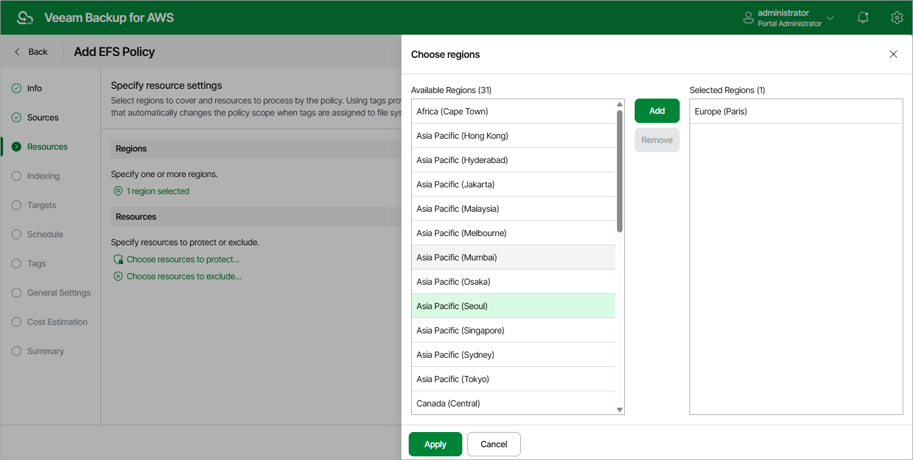
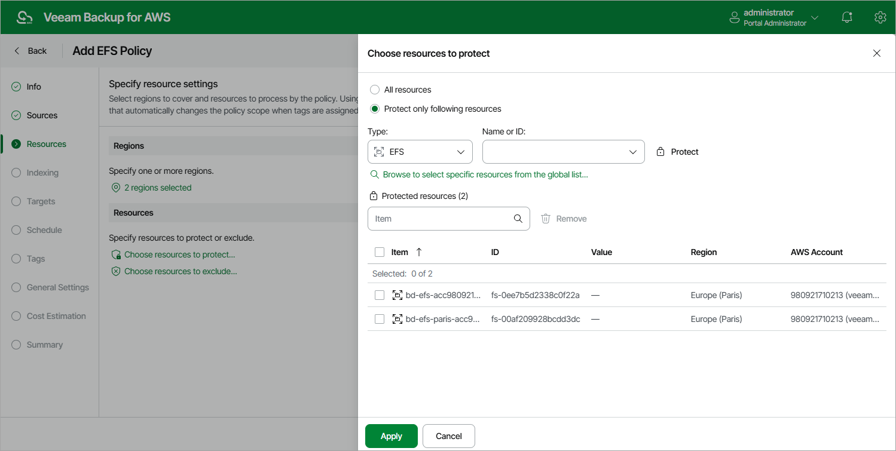

In this article

At the Resources step of the wizard, select AWS Regions where EFS file systems that you plan to back up reside and choose EFS file systems to back up.

Step 4a. Select AWS Regions

In the Regions section of the Resources step of the wizard, select AWS Regions where EFS file systems that you plan to back up reside:

1. Click Choose regions.
2. In the Choose regions window, select the necessary AWS Regions from the Available Regions list, and click Add.

The list of available regions will depend on the option you have selected at [step 3](add_policy_scope_efs.md) of the wizard. If you have selected the Organization option, the list will contain all existing AWS Regions; if you have selected the Account option, the list will contain all AWS Regions enabled for the AWS account.

1. To save changes made to the backup policy settings, click Apply.

Step 4b. Select EFS File Systems

In the Resources section of the Resources step of the wizard, specify the backup scope — select EFS file systems that Veeam Backup for AWS will back up:

1. Click Choose resources to protect.
2. In the Choose resources to protect window, choose whether you want to back up all EFS file systems from the selected AWS Regions or only specific file systems.

If you select the All resources option, Veeam Backup for AWS will regularly check for new EFS file systems reside in the selected regions and automatically update the backup policy settings to include these file systems into the backup scope.

If you select the Protect only following resources option, you must specify the EFS file systems explicitly:

1. Use the Type drop-down list to choose whether you want to add individual file systems or AWS tags to the backup scope.

If you select the Tag option, Veeam Backup for AWS will back up only those file systems that have specific tags and reside in the selected regions.

1. Use the Name or ID drop-down list to find the necessary resource, and then click Protect to add the resource to the backup scope.

For a resource to be displayed in the list of available resources, it must reside in an AWS Region that has ever been specified in any backup policy. Otherwise, the only option to discover the available resources is to click Browse to select specific resources from the global list and to wait for Veeam Backup for AWS to populate the resource list.

|  |
| --- |
| Note |
| By default, Veeam Backup for AWS uses AWS CloudTrail to track changes in your EFS resources. If no trails are configured in the source AWS account, Veeam Backup for AWS will automatically access AWS resources and populate the list of available file systems or AWS tags only once in 24 hours. To manually force the data collection process, click Rescan. |

If you add an AWS tag to the backup scope, Veeam Backup for AWS will regularly check for new Amazon EFS file systems assigned the added AWS tag and automatically update the backup policy settings to include these file systems in the scope. However, this applies only to file systems from the AWS Regions selected at [step 4a](#regions) of the wizard. If you select a tag assigned to file systems from other regions, these file systems will not be protected by the backup policy. To work around the issue, either go back to step 4a and add the missing regions, or create a new backup policy.

1. To save changes made to the backup policy settings, click Apply.

|  |
| --- |
| Tip |
| As an alternative to selecting the Protect only following resources option and specifying the resources explicitly, you can select the All resources option and exclude a number of resources from the backup scope. To do that, click Choose resources to exclude and specify the file system or tags that you do not want to protect — the procedure is the same as described for including resources in the backup scope.  Note that if a resource appears both in the list of included and excluded resources, Veeam Backup for AWS will still not process the resource because the list of excluded resources has a higher priority. |

Page updated 9/26/2025

Page content applies to build 10.0.0.232
