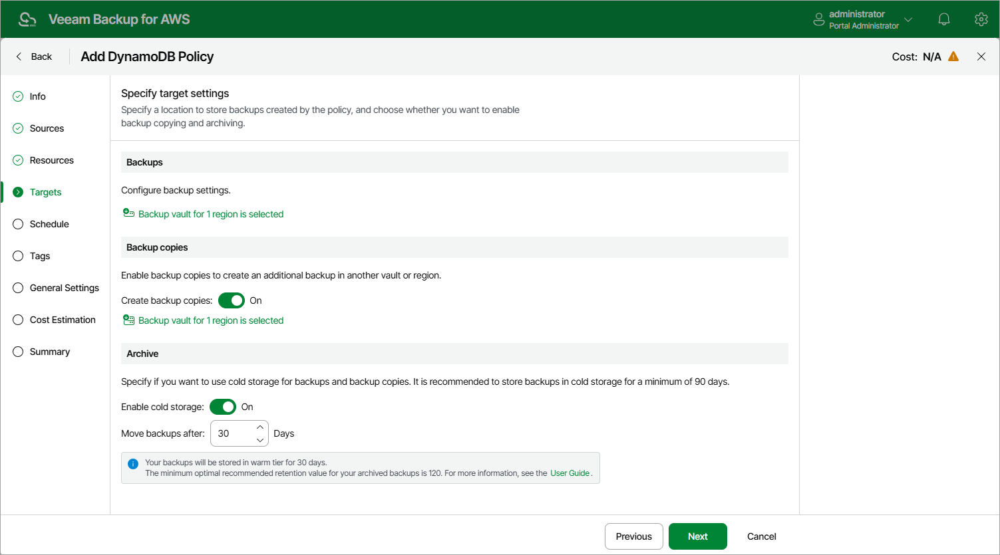

In this article

If you want to reduce the cost of storing backups that you plan to access infrequently, you can instruct Veeam Backup for AWS to move backups from a high-available warm storage tier to a low-cost cold storage tier:

1. In the Archive section of the Targets step of the wizard, set the Enable cold storage toggle to On.

Note that after you enable the archiving mechanism, you must configure the [retention policy settings](add_policy_schedule_retention_dynamo.md).

1. In the Move backups after field, specify the number of days for which you want to keep backups in a warm storage tier before moving them to a cold storage tier (the minimum value is 1; the maximum value is 36,135). As soon as the specified period is over, the backups will be moved to the cold storage tier and will be stored there according to the configured retention policy settings.

Keep in mind that once moved to a cold storage tier in an AWS Region, backups can only be used to restore tables to the same AWS Region. For more information, see [DynamoDB Restore](restore_point_dynamo.md#reqs).

|  |
| --- |
| Important |
| * It is recommended that you keep backups in a cold storage tier for at least 90 days since there is a [limitation on the AWS Backup service side](https://aws.amazon.com/backup/pricing/) — it will still charge you for 90 days even if your backups are stored for less than 90 days.  * The configured archive settings apply to all restore points (both backups and backup copies) that will be created by this backup policy. |

Page updated 8/21/2025

Page content applies to build 10.0.0.232
