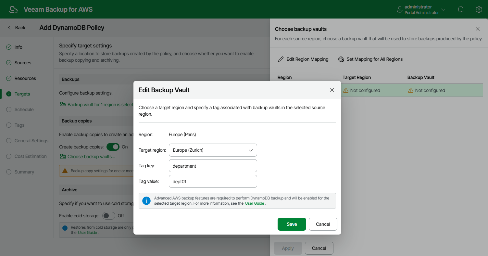

In this article

If you want to copy DynamoDB backups to other AWS Regions, do the following:

1. In the Backup copies section of the Targets step of the wizard, set the Create backup copies toggle to On.
2. In the Choose backup vaults window, configure the following mapping settings for each AWS Region where original tables reside:

1. Select a source AWS Region in the list and click Edit Region Mapping.
2. [Applies only if you have chosen the Account option at the Sources step of the wizard] In the Edit Backup Vault window, specify the following settings:

1. From the Target region drop-down list, select the target AWS Region to which Veeam Backup for AWS must copy created backups of the selected tables.
2. From the Backup vault drop-down list, select a backup vault that will be used to store the copied backups.

For a backup vault to be displayed in the list of available vaults, it must be created in the AWS Backup console as described in [AWS Documentation](https://docs.aws.amazon.com/aws-backup/latest/devguide/create-a-vault.html#creating-a-vault-console). If no custom backup vaults exist in the selected AWS Region, the list will contain the default backup vault only.

1. [Applies only if you have chosen the Organization option at the Sources step of the wizard] In the Edit Backup Vault window, specify the following settings:

1. From the Target region drop-down list, select the target AWS Region to which Veeam Backup for AWS must copy created backups of the selected tables.

1. In the Tag key and Tag value fields, specify a key and value of the AWS tag associated with the necessary backup vaults. The backup vault with the specified tag must be created in each AWS account within the AWS Organization or organizational units added to the backup policy. Note that the specified tag must not be associated with multiple backup vaults in the same AWS Region and account within the organization.

|  |
| --- |
| Important |
| * Veeam Backup for AWS does not support storing backups in [logically air-gapped vaults](https://docs.aws.amazon.com/aws-backup/latest/devguide/logicallyairgappedvault.html) and in backup vaults with the [AWS Backup Vault Lock](https://docs.aws.amazon.com/aws-backup/latest/devguide/vault-lock.html) feature enabled.  * Make sure policies assigned to the selected backup vault allow Veeam Backup for AWS to access vault resources and to perform backup, backup copy and restore operations, as well to remove backups. For more information on vault access policies, see [AWS Documentation](https://docs.aws.amazon.com/aws-backup/latest/devguide/create-a-vault-access-policy.html). * For Veeam Backup for AWS to be able to back up DynamoDB tables, you must configure the AWS Backup settings to enable both the Opt-in service and the advanced features for Amazon DynamoDB backups. Otherwise, Veeam Backup for AWS will automatically enable these settings for each AWS Region specified in the Backup copies section in your AWS account while performing backup operations. For more information on advanced DynamoDB backup, see [AWS Documentation](https://docs.aws.amazon.com/aws-backup/latest/devguide/advanced-ddb-backup.html). |

1. Click Save.

To configure mapping for all source AWS Regions at once, click Set Mapping for All Regions and specify settings as described in [step 2b](#step2.b) and [step 2c](#step2.c).

1. To save changes made to the backup policy settings, click Apply.

Page updated 10/8/2025

Page content applies to build 10.0.0.232
