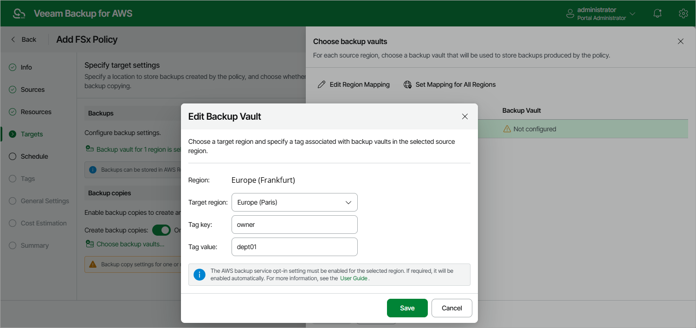

In this article

[This step applies only if you have selected file systems resided in default AWS Regions at the Sources step of the wizard. There is a limitation on the AWS Backup service side — cross-region copying of FSx backups is not supported for [opt-in Regions](https://docs.aws.amazon.com/controltower/latest/userguide/opt-in-region-considerations.html)]

If you want to copy FSx file system backups to other AWS Regions, do the following:

1. In the Backup copies section of the Targets step of the wizard, set the Create backup copies toggle to On.
2. In the Choose backup vaults window, configure the following mapping settings for each AWS Region where original file systems reside:

1. Select a source AWS Region in the list and click Edit Region Mapping.

1. [Applies only if you have chosen the Account option at the Sources step of the wizard] In the Edit Region Mapping window, specify the following settings:

1. From the Target region drop-down list, select the target AWS Region to which Veeam Backup for AWS must copy created backups of the selected file systems. The region list shows only the default AWS Regions (that is, the AWS Regions activated for the AWS account by default).
2. From the Backup vault drop-down list, select a backup vault that will be used to store the copied backups.

For a backup vault to be displayed in the Backup vault list, it must be created in the AWS Backup console as described in [AWS Documentation](https://docs.aws.amazon.com/aws-backup/latest/devguide/create-a-vault.html#creating-a-vault-console). If you have not created a backup vault for the selected AWS Region, Veeam Backup for AWS will display only the default backup vault existing in this region.

1. [Applies only if you have chosen the Organization option at the Sources step of the wizard] In the Edit Region Mapping window, specify the following settings:

1. From the Target region drop-down list, select the target AWS Region to which Veeam Backup for AWS must copy created backups of the selected file systems.

1. In the Tag key and Tag value fields, specify a key and value of the AWS tag associated with the necessary backup vaults. The backup vault with the specified tag must be created in each AWS account within the AWS Organization or organizational units added to the backup policy. Note that the specified tag must not be associated with multiple backup vaults in the same AWS Region and account within the organization.

|  |
| --- |
| Important |
| * Veeam Backup for AWS does not support storing backups in [logically air-gapped vaults](https://docs.aws.amazon.com/aws-backup/latest/devguide/logicallyairgappedvault.html) and in backup vaults with the [AWS Backup Vault Lock](https://docs.aws.amazon.com/aws-backup/latest/devguide/vault-lock.html) feature enabled..  * Since cross-region copying of FSx backups is not supported for opt-in Regions, the list of available regions will depend on the original location of the selected file system. If the original location is a default AWS Region, the Target region list will contain all default AWS Regions; if the original location is an opt-in Region, there is no possibility to specify any AWS Regions. * Make sure policies assigned to the selected backup vault allow Veeam Backup for AWS to access vault resources and to perform backup, backup copy and restore operations. For more information on vault access policies, see [AWS Documentation](https://docs.aws.amazon.com/aws-backup/latest/devguide/create-a-vault-access-policy.html). * For Veeam Backup for AWS to be able to back up FSx file systems, you must enable the Opt-in service for the FSx resource type in the AWS Backup settings. Otherwise, Veeam Backup for AWS will automatically enable the service for each AWS Region specified in the Backup copies section in your AWS account while performing backup operations. |

1. Click Save.

To configure mapping for all source AWS Regions at once, click Set Mapping for All Regions and specify settings as described in [step 2.b](#step2.b) and [step 2.c](#step2.c).

1. To save changes made to the backup policy settings, click Apply.

Page updated 10/8/2025

Page content applies to build 10.0.0.232
