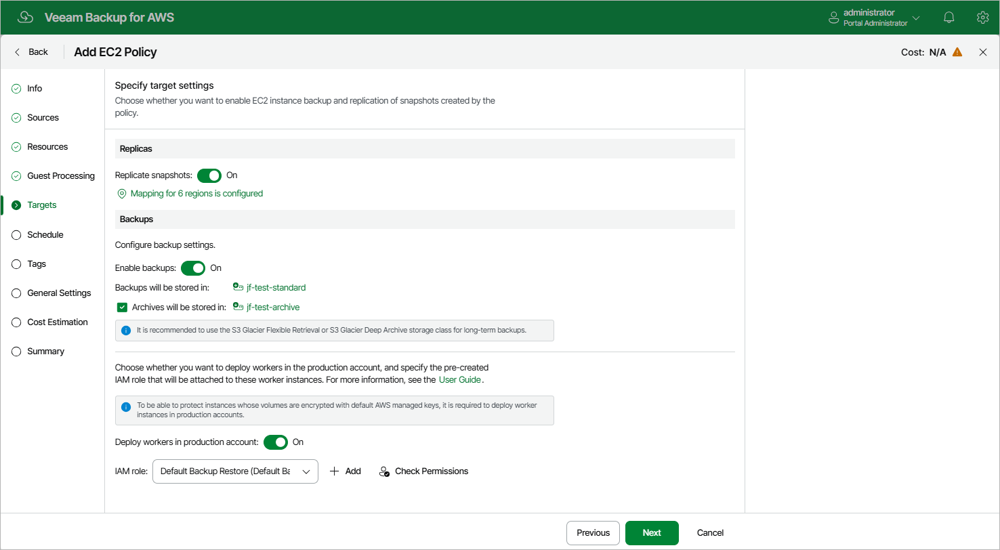

In this article

In the Backups section of the Targets step of the wizard, you can instruct Veeam Backup for AWS to create image-level backups of the processed EC2 instances, to copy backups to a long-term archive storage, and to deploy worker instances used for backup operations in a [production account](worker_options.md#production).

Configuring Backup Settings

To instruct Veeam Backup for AWS to create image-level backups of the selected EC2 instances, do the following:

1. Set the Enable backups toggle to On.
2. In the Repositories window, select a backup repository where the created image-level backups will be stored, and click Apply.

For a backup repository to be displayed in the list of available repositories, it must be added to Veeam Backup for AWS as described in section [Adding Backup Repositories Using Web UI](repositories_add_ui.md). The list shows only backup repositories of the S3 Standard storage class.

To learn how Veeam Backup for AWS creates image-level backups, see [EC2 Backup](backup_hiw_ec2.md).

Configuring Archive Settings

To instruct Veeam Backup for AWS to store backed-up data in a low-cost, long-term archive storage, do the following:

1. Select the Archives will be stored in check box.
2. In the Repositories window, select a backup repository where the archived data will be stored, and click Apply.

For an archive backup repository to be displayed in the list of available repositories, it must be added to Veeam Backup for AWS as described in section [Adding Backup Repositories Using Web UI](repositories_add_ui.md). The list shows only backup repositories of the S3 Glacier Flexible Retrieval or S3 Glacier Deep Archive storage classes.

For more information on backup archiving, see [Enabling Backup Archiving](backup_archiving.md).

|  |
| --- |
| Important |
| If you enable the backup archiving, consider that data encryption must be either enabled or disabled for both backup and archive backup repositories. This means that, for example, you cannot select an encrypted standard backup repository and an unencrypted archive backup repository in one backup policy. However, the selected repositories can have different encryption schemes (password and KMS encryption). |

Configuring Worker Settings

By default, Veeam Backup for AWS deploys worker instances used to perform backup operations in the [backup account](worker_options.md). However, you can instruct Veeam Backup for AWS to deploy worker instances in a production account — that is, the same AWS account to which the processed resources belong. To do that, set the Deploy workers in production account toggle to On.

Depending on the option selected at [step 3](add_policy_scope.md) of the wizard, the following will happen:

* If you have selected the Account option, you will be able to choose an IAM role that will be attached to the worker instances and used by Veeam Backup for AWS to communicate with these instances. The role you choose must belong to the same account to which the IAM role specified for the backup operation belongs, and must be assigned the permissions listed in section [Worker Deployment Role Permissions in Production Accounts](role_permissions_prod_acc.md#worker_reqs).

For an IAM role to be displayed in the list of available roles, it must be added to Veeam Backup for AWS with the Production worker role selected as described in section [Adding IAM Roles](https://helpcenter.veeam.com/docs/vbaws/guide/iam_roles_add.html). If you have not added the necessary IAM role to Veeam Backup for AWS beforehand, you can do it without closing the Add Policy wizard. To do that, click Add and complete the Add IAM Role wizard.

* If you have selected the Organization option, Veeam Backup for AWS will automatically choose an IAM role that will be attached to the worker instances and used by Veeam Backup for AWS to communicate with these instances. It will be one of the roles specified in the settings of the selected organization identity — either the IAM role whose permissions will be used to perform the backup operation (that is, the Backup and restore IAM role), or the IAM role that will be attached to the worker instances and used by Veeam Backup for AWS to communicate with these instances (that is, the Production worker IAM role).

For Veeam Backup for AWS to be able to choose an IAM role automatically, it must be created in all AWS accounts belonging to the selected organization identity, and specified in the organization settings as described in section [Adding AWS Organizations](organization_add_settings.md#backup_role) (step 3).

|  |
| --- |
| Important |
| * If you instruct Veeam Backup for AWS to deploy worker instances in production accounts, you must assign additional permissions to the IAM role used to perform the backup operation. For more information on the required permissions, see [EC2 Backup IAM Role Permissions](role_permissions_backup_ec2.md).  * [Applies only if you have chosen the Account option at the Source step of the wizard] It is recommended that you check whether both the IAM role specified at [step 3](add_policy_scope.md#account) of the wizard and the IAM role specified in the Backups section have the required permissions — if some of the permissions are missing, the backup policy may fail to complete successfully. To run the IAM role permission check, click Check Permissions and follow the instructions provided in section [Checking IAM Role Permissions](iam_roles_check.md#wizard).  * Veeam Backup for AWS may fail to create image-level backups of EC2 instances with [product codes](https://docs.aws.amazon.com/marketplace/latest/userguide/ami-getting-started.html#ami-product-codes) if the AMIs that were used to launch the instances do not support the type of worker instances deployed for the backup operation. To work around the issue, modify the worker profile to choose another instance type, as described in section [Managing Worker Profiles](worker_profiles.md).  * Veeam Backup for AWS does not support backup and restore of EC2 instances with [product codes](https://docs.aws.amazon.com/marketplace/latest/userguide/ami-getting-started.html) that have vendor restrictions preventing root EBS volumes from being attached to worker instances as secondary volumes. To learn how Veeam Backup for AWS performs EC2 backup, see [Protecting EC2 Instances](backup_hiw_ec2.md). |

Page updated 11/21/2025

Page content applies to build 10.0.0.232
