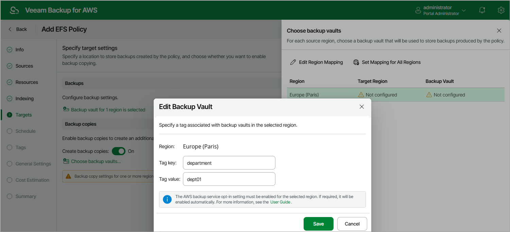

In this article

To specify backup vaults used to store backups of the selected EFS file systems, do the following:

1. In the Backups section of the Targets step of the wizard, click Choose backup vaults.
2. In the Choose backup vaults window, for each AWS Region included in the policy, specify a backup vault to save and organize file system backups. To do that:

1. Select an AWS Region and click Edit.
2. [Applies only if you have chosen the Account option at the Sources step of the wizard] In the Edit Backup Vault window, from the Backup vault drop-down list, select the necessary backup vault.

For a backup vault to be displayed in the list of available backup vaults, it must be created in the AWS Backup console as described in [AWS Documentation](https://docs.aws.amazon.com/aws-backup/latest/devguide/create-a-vault.html#creating-a-vault-console). If no custom backup vaults exist in the selected AWS Region, the list will contain the default backup vault only.

1. [Applies only if you have chosen the Organization option at the Sources step of the wizard] In the Edit Backup Vault window, in the Tag key and Tag value fields, specify a key and value of the AWS tag associated with the necessary backup vaults. The backup vault with the specified tag must be created in each AWS account within the AWS Organization or organizational units added to the backup policy. Note that the specified tag must not be associated with multiple backup vaults in the same AWS Region and account within the organization.

To configure mapping for all AWS Regions within the selected organization at once, click Set Mapping for All Regions.

|  |
| --- |
| Important |
| * Veeam Backup for AWS does not support storing backups in [logically air-gapped vaults](https://docs.aws.amazon.com/aws-backup/latest/devguide/logicallyairgappedvault.html) and in backup vaults with the [AWS Backup Vault Lock](https://docs.aws.amazon.com/aws-backup/latest/devguide/vault-lock.html) feature enabled.  * Make sure policies assigned to the selected backup vault allow Veeam Backup for AWS to access vault resources and to perform backup, backup copy and restore operations, as well as to remove backups. For more information on vault access policies, see [AWS Documentation](https://docs.aws.amazon.com/aws-backup/latest/devguide/create-a-vault-access-policy.html).  * For Veeam Backup for AWS to be able to back up EFS file systems, you must enable the Opt-in service for the EFS resource type in the AWS Backup settings. Otherwise, Veeam Backup for AWS will automatically enable the service for each AWS Region specified in the Backups section in your AWS account while performing backup operations. |

1. Click Save.

1. To save changes made to the backup policy settings, click Apply.

Page updated 9/29/2025

Page content applies to build 10.0.0.232
