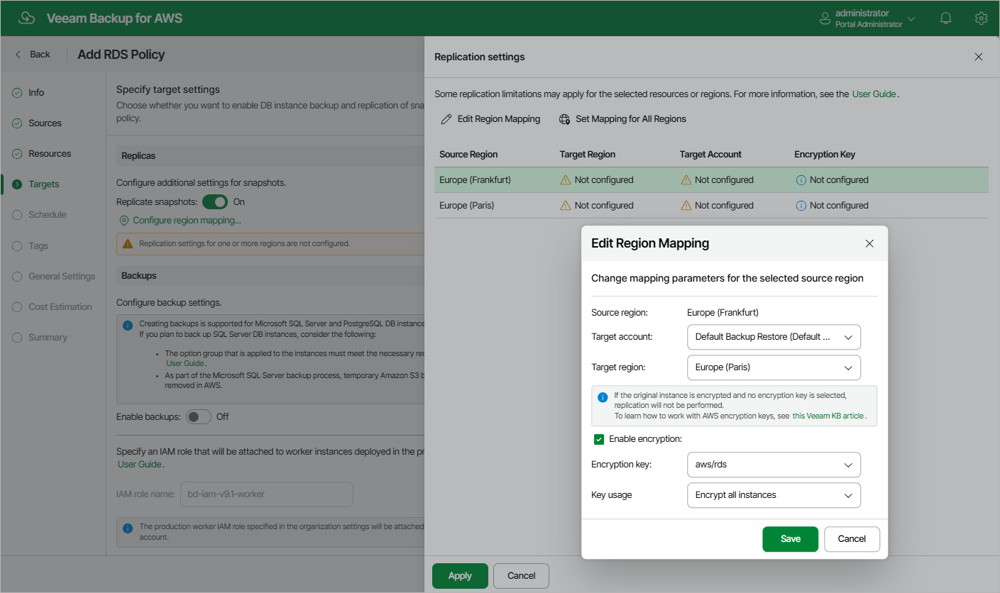

In this article

If you want to replicate cloud-native snapshots to other AWS accounts or regions, do the following:

1. In the Snapshots section of the Targets step of the wizard, set the Replicate snapshots toggle to On.
2. In the Replication settings window, configure the following mapping settings for each AWS Region where source instances reside:

|  |
| --- |
| Important |
| If DB engine versions of the processed Aurora DB clusters are not supported in the target AWS Region, the replication operation will fail. For the list of supported DB engine versions in AWS Regions, see [AWS Documentation](https://docs.aws.amazon.com/AmazonRDS/latest/AuroraUserGuide/Concepts.AuroraFeaturesRegionsDBEngines.grids.html). |

1. Select a source AWS Region from the list and click Edit Region Mapping.
2. In the Edit Region Mapping window, specify the following settings:

1. From the Target account drop-down list, select an IAM role whose permissions will be used to replicate cloud-native snapshots. The specified IAM role must belong to the AWS account in which the cloud-native snapshots will reside.

For an IAM role to be displayed in the list of available roles, it must be added to Veeam Backup for AWS with the Amazon RDS Replication operation selected as described in section [Adding IAM Roles](iam_roles_add.md).

1. From the Target region drop-down list, select a target AWS Region to which Veeam Backup for AWS will replicate cloud-native snapshots.
2. If you want to encrypt the replicated cloud-native snapshots with an AWS KMS key, select the Enable encryption check box and choose the necessary KMS key from the Encryption key drop-down list. Then, use the Key usage drop-down list to choose whether you want to encrypt snapshots for all resources or only snapshots of the encrypted resources. Note that if the source DB instances or Aurora DB clusters are encrypted, you must enable encryption for replicated snapshots as well; if the source Aurora DB clusters are unencrypted, the encryption must be disabled for replicated snapshots as well — otherwise, the replication process will fail to complete successfully.

For a KMS key to be displayed in the list of available encryption keys, it must be stored in the AWS Region selected at [step 4a](add_policy_source_settings_rds.md#regions) of the wizard and the IAM role specified for the backup operation must have permissions to access the key. For more information on KMS keys, see [AWS Documentation](https://docs.aws.amazon.com/kms/latest/developerguide/create-keys.html).

1. Click Save.

1. To save changes made to the backup policy settings, click Apply.

|  |
| --- |
| Tip |
| To configure mapping for all source AWS Regions at a time, click Set Mapping for All Regions and follow the instructions provided at [step 2b](#step2.b) of the wizard. |

Page updated 10/8/2025

Page content applies to build 10.0.0.232
