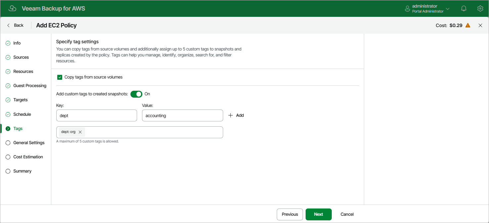

In this article

At the Tags step of the wizard, you can choose whether you want to assign to cloud-native snapshots and snapshot replicas of the selected EC2 instances already existing tags from EBS volumes and your own custom tags.

If you set the Add custom tags to created snapshots toggle to On, you must also specify the tags explicitly. To do that, use the Key and Value fields to specify a key and a value for the new custom AWS tag, and then click Add. Note that you cannot add more than 5 custom tags.

Page updated 11/24/2025

Page content applies to build 10.0.0.232
