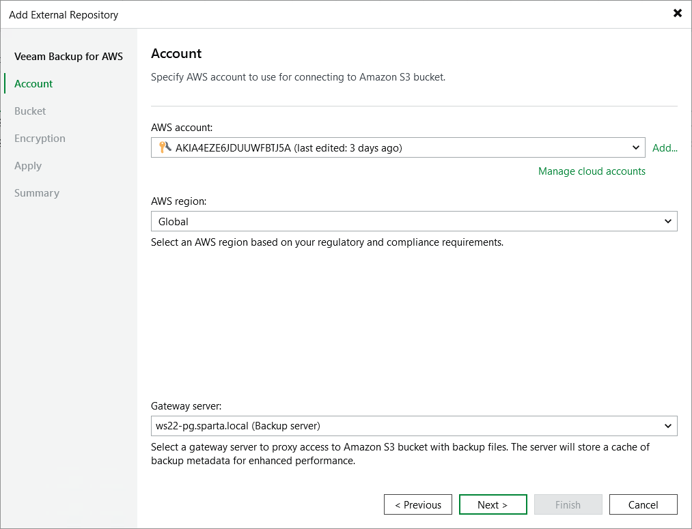

In this article

At the Account step of the wizard, do the following:

1. From the AWS account drop-down list, select access keys of an IAM user whose permissions Veeam Backup & Replication will use to access the repository. For more information on the required permissions that must be assigned to the IAM user, see [Plug-In Permissions](req_permissions.md).

For access keys of an IAM user to be displayed in the AWS account drop-down list, they must be created in AWS and added to the Cloud Credentials Manager as described in the Veeam Backup & Replication User Guide, section [Access Keys for AWS Users](https://helpcenter.veeam.com/docs/vbr/userguide/cloud_credentials_aws.html?ver=13). If you have not added the keys to the Cloud Credentials Manager beforehand, you can do it without closing the wizard. To do that, click either the Manage cloud accounts link or the Add button, and specify the access key and secret key in the Credentials window.

1. From the AWS region drop-down list, specify whether the repository will be located in an AWS Global or AWS GovCloud (US) region.

|  |
| --- |
| Important |
| To check the availability of the region, Veeam Backup & Replication by default establishes a temporary test connection with the US East (N. Virginia) region using endpoints of the [AWS Security Token Service (STS)](https://docs.aws.amazon.com/general/latest/gr/sts.html) and [Amazon Elastic Compute Cloud (EC2)](https://docs.aws.amazon.com/general/latest/gr/ec2-service.html) AWS services. That is why the backup server must have access to this AWS Region. If you want to change the default region for a test connection, open a [support case](logs.md). |

1. [Applies only if you choose to create a standard backup repository] From the Gateway server drop-down list, select a gateway server that will be used to access the repository.

For a server to be displayed in the Gateway server list, it must be added to the backup infrastructure. For more information on gateway servers, see [Solution Architecture](overview.md).

Page updated 10/14/2025

Page content applies to build 10.0.0.232
