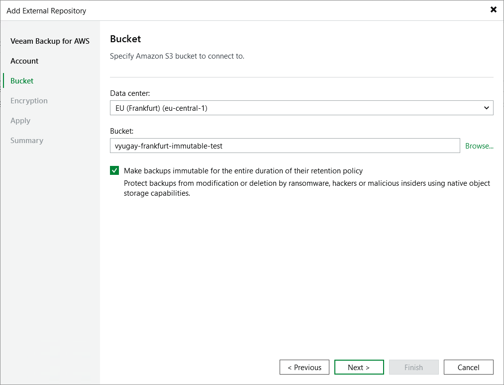

In this article

At the Bucket step of the wizard, do the following:

1. From the Data center drop-down list, select an AWS Region where the repository will be located.
2. Choose whether you want to use an existing bucket or to create a new one as the target location for image-level backups of EC2 instances and RDS resources, additional copies of Amazon VPC backups and indexes of EFS file systems:

* To specify an existing bucket, in the Bucket field, enter the name of an Amazon S3 bucket where the repository will be created.

Alternatively, click Browse and select the necessary bucket in the Select Bucket window. For a bucket to be displayed in the Bucket list, it must be created in AWS as described in [AWS Documentation](https://docs.aws.amazon.com/AmazonS3/latest/userguide/create-bucket-overview.html).

|  |
| --- |
| Important |
| * If you have any S3 Lifecycle configuration associated with the selected Amazon S3 bucket, make sure that the lifecycle rules do not apply to the backup files created by the backup appliance. Otherwise, the backup files may be unexpectedly deleted or transitioned to another storage class, and the backup appliance will not be able to access the files. For more information on managing S3 Lifecycle configurations, see [AWS Documentation](https://docs.aws.amazon.com/AmazonS3/latest/userguide/how-to-set-lifecycle-configuration-intro.html).  * If you plan to enable immutability settings for the created repository, S3 Versioning and Object Lock must be enabled for the specified Amazon S3 bucket, and no default retention period must be configured for the bucket. For more information on Amazon S3 immutability features, see [AWS Documentation](https://docs.aws.amazon.com/AmazonS3/latest/userguide/managing-storage.html). |

* To create a new bucket, click Browse. In the Select Bucket window, click New Bucket and enter a name for the bucket. Veeam Backup & Replication will automatically create a bucket in the specified AWS Region. Note that the bucket name must meet the requirements described in [AWS Documentation](https://docs.aws.amazon.com/AmazonS3/latest/userguide/bucketnamingrules.html).

If you want to enable immutability settings for the bucket, select the Enable immutability check box in the New Bucket window. Veeam Backup & Replication will automatically create a bucket with the S3 Versioning and Object Lock options enabled in the specified AWS Region. For more information on Amazon S3 immutability features, see [AWS Documentation](https://docs.aws.amazon.com/AmazonS3/latest/userguide/managing-storage.html).

1. [Applies only if you have selected or created a bucket with immutability settings enabled] If you want to protect backups stored in the repository from being lost as a result of malware, ransomware or any other malicious actions, you can enable immutability at the repository level. To do that, select the Make backups immutable for the entire duration of their retention policy check box. For more information on immutability, see [Immutability](immutability.md).

|  |
| --- |
| Important |
| * You cannot create standard backup repositories with the disabled immutability settings in Amazon S3 buckets with the S3 Versioning and Object Lock options enabled.  * You cannot edit the configured immutability settings after the repository is created. |

1. [Applies only if you choose to create an archive backup repository] When you create an archive backup repository, backups are stored in a secure, durable and low-cost S3 Glacier Flexible Retrieval storage class by default. To store backups in the lowest-cost S3 Glacier Deep Archive storage class that you plan to access once or twice a year, select the Use the Deep Archive storage class check box. Note that after the repository is created, you will be unable to change the selected storage class.

|  |
| --- |
| Note |
| When you create an archive backup repository, Veeam Backup for AWS does not create any S3 Glacier vaults in Amazon S3. Instead, it assigns the selected storage class (S3 Glacier Flexible Retrieval or S3 Glacier Deep Archive) to backups stored in the repository. That is why the archived backups remain in Amazon S3 and cannot be accessed directly through the Amazon S3 Glacier service. |

Page updated 10/14/2025

Page content applies to build 10.0.0.232
