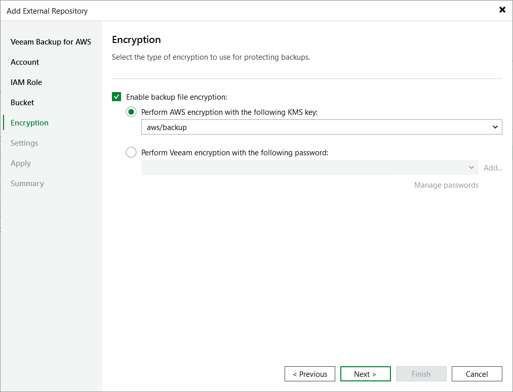

In this article

At the Encryption step of the wizard, choose whether you want to encrypt backups stored in the created repository.

|  |
| --- |
| Important |
| After you create a repository with encryption enabled, you can no longer disable encryption for this repository. However, you will be able to change the encryption settings as described in section [Editing Backup Repository Settings](repositories_edit.md). |

If you select the Enable backup file encryption check box, also choose whether you want to use a password or an AWS Key Management Service (KMS) key to encrypt the backed-up data:

* To encrypt data using an AWS KMS key, select the Perform AWS encryption with the following KMS key option and choose the necessary KMS key from the drop-down list.

For a KMS key to be displayed in the list of available encryption keys, it must be [created in the AWS Region](https://docs.aws.amazon.com/kms/latest/developerguide/create-keys.html) where the selected Amazon S3 bucket is located, and the IAM role specified to access the bucket must have permissions to access the key. For more information on permissions required for the IAM role, see [Repository IAM Permissions](role_permissions_repo.md).

|  |
| --- |
| Note |
| For Veeam Backup & Replication to be able to decrypt data stored in the repository, the IAM user specified at [step 3](add_s3_account.md) of the wizard must have permissions to access KMS keys. For more information on the required permissions, see [Plug-in Permissions](req_permissions.md#kms_permissions). |

* To encrypt data using a password, select the Perform Veeam encryption with the following password option and choose the necessary password from the drop-down list.

For a password to be displayed in the list of available passwords, it must be added to Veeam Backup & Replication as described in the Veeam Backup & Replication User Guide, section [Creating Passwords](https://helpcenter.veeam.com/docs/vbr/userguide/password_manager_create.html?ver=13). If you have not added the necessary password beforehand, you can do it without closing the wizard. To do that, click either the Manage passwords link or the Add button, and specify the password and hint in the Password window.

|  |
| --- |
| Important |
| If you select the Perform AWS encryption with the following KMS key option, consider the following:   * Only symmetric KMS keys are supported. * Do not disable the KMS key specified in the repository settings. Otherwise, the backup appliance will not be able to encrypt data, and backup policies that use the repository as the backup target will fail to complete successfully. * Do not delete the KMS key specified in the repository settings. Otherwise, the backup appliance will not be able to decrypt data stored in the repository. |

Page updated 9/2/2025

Page content applies to build 10.0.0.232
