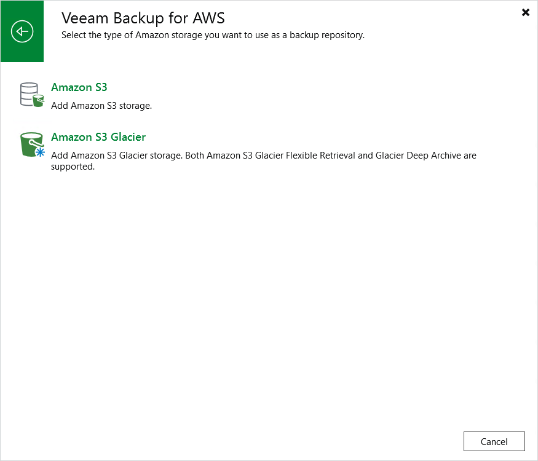

In this article

To launch the Add External Repository wizard, do the following:

1. In the Veeam Backup & Replication console, open the Backup Infrastructure view.
2. Navigate to External Repositories and click Add Repository on the ribbon.

Alternatively, you can right-click the External Repositories node and select Add.

1. In the Add External Repository window:

1. [Applies only if you have several cloud plug-ins installed] Click Veeam Backup for AWS.
2. Choose whether you want to create a standard or an archive backup repository:

* Select the Amazon S3 option if you want to create a repository with the S3 Standard storage class assigned.
* Select the Amazon S3 Glacier option if you want to create a repository with the S3 Glacier Flexible Retrieval or S3 Glacier Deep Archive storage class assigned.

Page updated 8/11/2025

Page content applies to build 10.0.0.232
