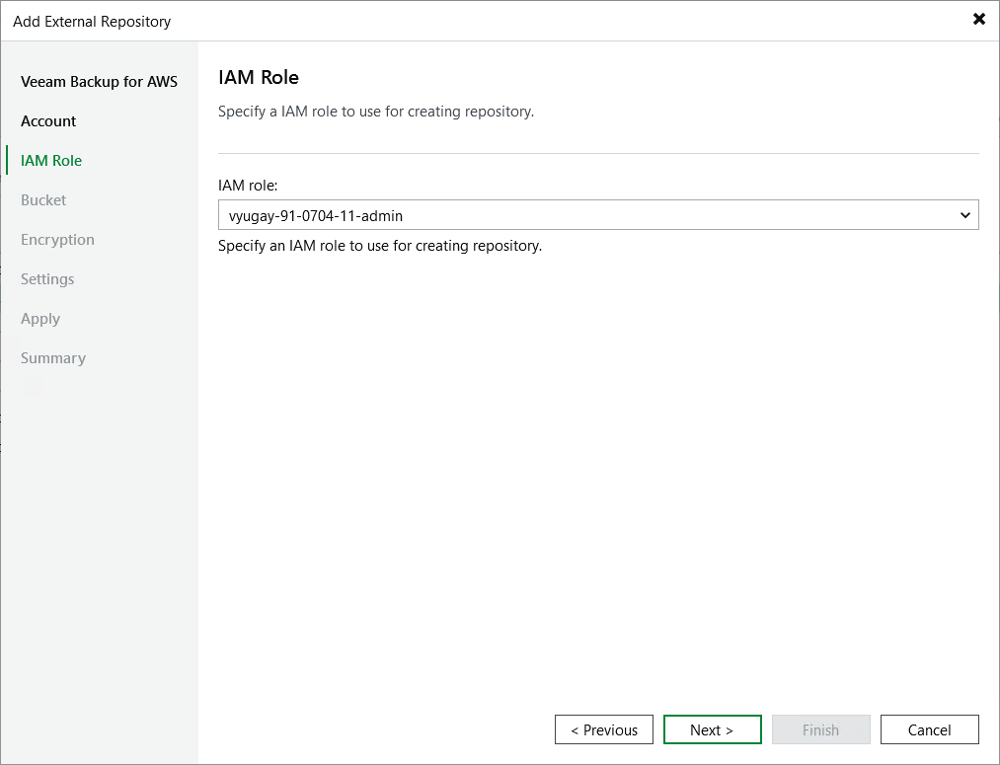

In this article

[This step applies only if you have added to the backup appliance multiple IAM roles belonging to the same AWS account]

At the IAM Identity step of the wizard, select an IAM role whose permissions will be used to create the repository and to access the target Amazon S3 bucket. For more information on the required permissions that must be assigned to the IAM role, see [Restore IAM Permissions](role_permissions_restore.md).

For an IAM role to be displayed in the IAM role drop-down list, it must be added to the backup appliance with the Repository role selected as described in section [Adding IAM Roles](iam_roles_specify_permissions.md), and must belong to the same AWS account to which the IAM user specified at [step 3](add_s3_account.md) of the wizard belongs.

Page updated 9/2/2025

Page content applies to build 10.0.0.232
