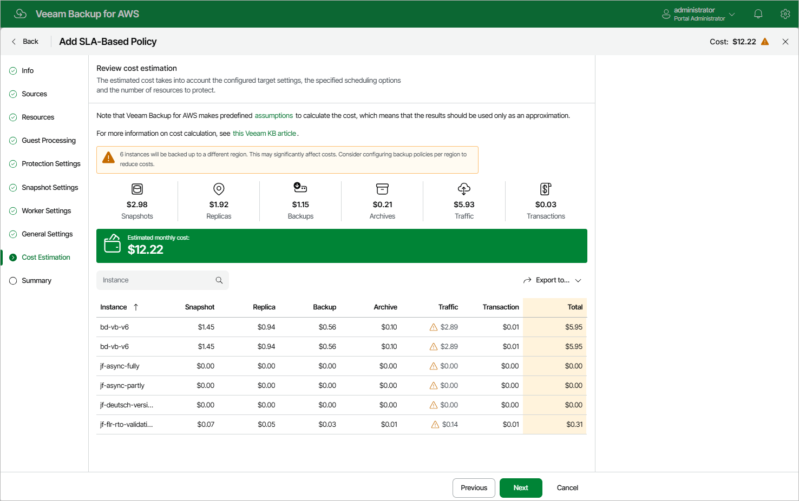

In this article

[This step applies only if you have selected an SLA template with backups enabled at the Protection Settings step of the wizard]

At the Cost Estimation step of the wizard, review the estimated monthly cost of AWS services and resources that will be consumed to protect the instances added to the backup policy. The total estimated cost includes the following:

* The cost of creating and maintaining cloud-native snapshots of the instances.

For each instance included in the backup policy, Veeam Backup for AWS takes into account the instance type, the number of EBS volumes attached, the number of restore points to be kept in the snapshot chain, and the configured scheduling settings.

* The cost of creating snapshot replicas and maintaining them in the target AWS Region.

For each instance included in the backup policy, Veeam Backup for AWS takes into account the instance type, the number of EBS volumes attached, the number of restore points to be kept in the snapshot chain, and the configured scheduling settings.

* The cost of creating and storing in backup repositories image-level backups of the instances.

For each instance included in the backup policy, Veeam Backup for AWS takes into account the machine type, the number of EBS volumes attached, the number of restore points to be kept in the backup chain, and the configured scheduling settings.

* The cost of creating and storing in archive repositories archived backups of the instances.

For each instance included in the backup policy, Veeam Backup for AWS takes into account the machine type, the number of EBS volumes attached, the number of restore points to be kept in the archive backup chain, and the configured scheduling settings.

* The cost of transferring the instance data between AWS Regions during data protection operations (for example, if a protected instance and the target backup repository reside in different regions).

* The cost of sending API requests to AWS during data protection operations.

|  |
| --- |
| Note |
| To calculate the estimated cost, Veeam Backup for AWS uses the capabilities of the [AWS Pricing Calculator](https://calculator.aws/#/?key=new) that estimates the cost of services in USD only. This calculator is intended for informational and estimation purposes only. |

The estimated cost may occur to be significantly higher due to the backup frequency, cross-region data transfer and snapshot charges. To reduce the cost, you can try the following workarounds:

* To avoid additional costs related to cross-region data transfer, select a backup repository that resides in the same region as instances that you plan to back up.
* To reduce high snapshot charges, adjust the snapshot retention settings to keep less restore points in the snapshot chain.
* To optimize the cost of storing backups, configure the scheduling settings to run the backup policy less frequently, or specify an archive backup repository for long-term retention of restore points.

For more information on cost estimation, see [this Veeam KB article](https://www.veeam.com/kb3054).

|  |
| --- |
| Tip |
| You can save the cost estimation as a .CSV or .XML file. To do that, click Export to and select the necessary format. |

Related Resources

[How AWS Pricing Works](https://docs.aws.amazon.com/whitepapers/latest/how-aws-pricing-works/welcome.html)

Page updated 12/5/2025

Page content applies to build 10.0.0.232
