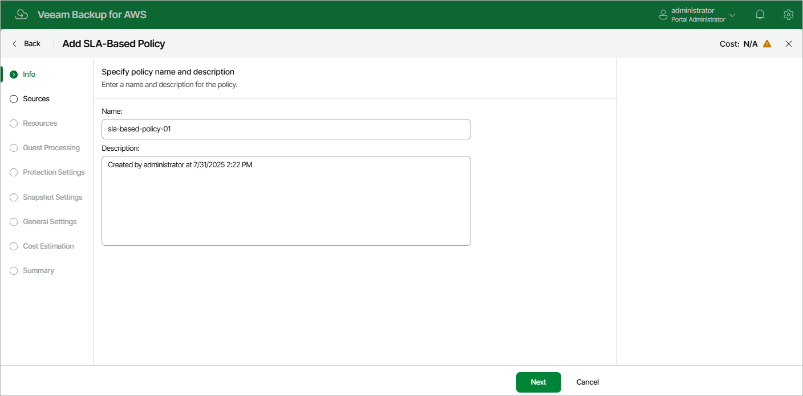

In this article

At the Info step of the wizard, use the Name and Description fields to specify a name for the new backup policy and to provide a description for future reference. The name must be unique in Veeam Backup for AWS; the maximum length of the name is 127 characters, the maximum length of the description is 255 characters.

Page updated 7/31/2025

Page content applies to build 10.0.0.232
