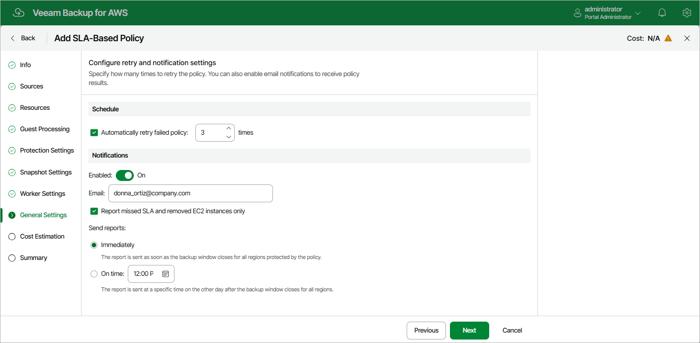

In this article

At the General Settings step of the wizard, you can enable automatic retries, schedule health checks and specify notification settings for the backup policy.

Automatic Retry Settings

To instruct Veeam Backup for AWS to run the backup policy again if it fails on the first try, do the following:

1. In the Schedule section of the step, select the Automatically retry failed policy check box.
2. In the field to the right of the check box, specify the maximum number of attempts to run the backup policy. The time interval between retries is 60 seconds.

When retrying backup policies, Veeam Backup for AWS processes only those instances that failed to be backed up during the previous attempt.

Notification Settings

To instruct Veeam Backup for AWS to send email notifications for the backup policy, do the following:

1. In the Notifications section of the step, set the Enabled toggle to On.

If you set the toggle to Off, Veeam Backup for AWS will send notifications according to the configured [global notification settings](email_settings.md).

1. In the Email field, specify an email address of a recipient.

Use a semicolon to separate multiple recipient addresses. Do not use spaces after semicolons between the specified email addresses.

1. Select the Report missed SLA and removed EC2 instances only check box if you want Veeam Backup for AWS to send email notifications only in case the backup policy fails to meet SLA target value, or if any EC2 instances added to the policy are [considered removed](sla_calculation.md) from AWS.
2. Use the Send reports setting to define whether you want Veeam Backup for AWS to send email notifications immediately after it finalizes the backup window specified for the policy in all AWS Regions added to the policy and completes calculating SLA compliance ratio, or at a specific time after Veeam Backup for AWS finalizes the backup window specified for the policy in all AWS Regions added to the policy and completes calculating SLA compliance ratio.

|  |
| --- |
| Note |
| If you specify the same email recipient in both backup policy notification and [global notification settings](email_settings.md), Veeam Backup for AWS will override the configured global notification settings and will send each notification to this recipient only once to avoid notification duplicates. |

Page updated 11/21/2025

Page content applies to build 10.0.0.232
