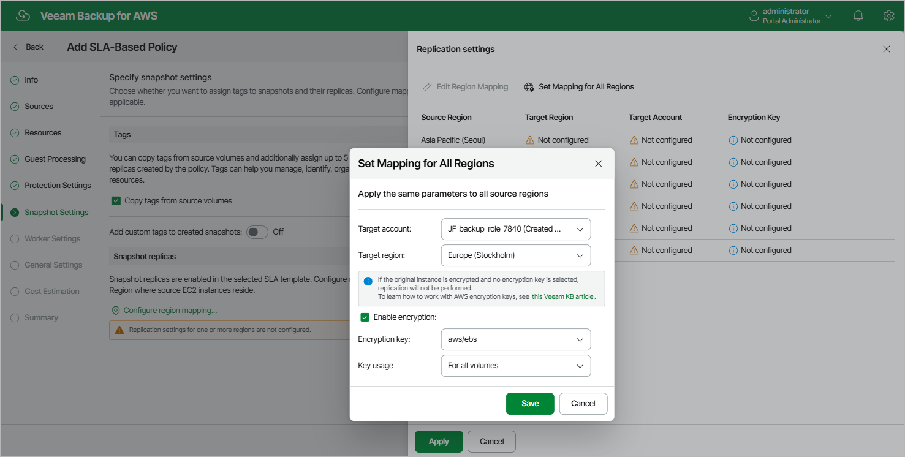

In this article

At the Snapshot Settings step of the wizard, you can enable tag assignment for cloud-native snapshots and snapshot replicas created by the policy and select a custom target location for the snapshot replicas.

Tag Assignment

In the Tags section, you can choose whether you want to assign to cloud-native snapshots and snapshot replicas of the selected EC2 instances already existing tags from EBS volumes and your own custom tags.

If you set the Add custom tags to created snapshots toggle to On, you must also specify the tags explicitly. To do that, use the Key and Value fields to specify a key and a value for the new custom AWS tag, and then click Add. Note that you cannot add more than 5 custom tags.

Snapshot Replica Location Settings

[This step applies only if you have selected an SLA template with snapshot replicas enabled at the Protection Settings step of the wizard]

In the Snapshot Replicas section, do the following:

1. Click Configure region mapping.
2. In the Replication settings window, configure the following mapping settings for each AWS Region where source EC2 instances reside:

1. Select a source AWS Region from the list and click Edit Region Mapping.
2. In the Edit Region Mapping window, specify the following settings:

1. From the Target account drop-down list, select an IAM role whose permissions will be used to replicate cloud-native snapshots. The selected IAM role must belong to the AWS account in which the cloud-native snapshots will reside.

For an IAM role to be displayed in the list of available roles, it must be added to Veeam Backup for AWS with the Amazon EC2 Replication operation selected as described in section [Adding IAM Roles](iam_roles_add.md).

1. From the Target region drop-down list, select a target AWS Region to which Veeam Backup for AWS will replicate cloud-native snapshots.
2. If you want to encrypt the replicated cloud-native snapshots with an AWS KMS key, select the Enable encryption check box and choose the necessary KMS key from the Encryption key drop-down list. Then, use the Key usage drop-down list to choose whether you want to encrypt snapshots for all volumes or only snapshots of the encrypted volumes. Note that if the original EBS volumes are encrypted, you must enable encryption for replicated snapshots as well — otherwise, the replication process will fail to complete successfully.

For a KMS key to be displayed in the list of available encryption keys, it must be stored in the target AWS Region, and the IAM role specified for the replication operation must have permissions to access the key. For more information on KMS keys, see [AWS Documentation](https://docs.aws.amazon.com/kms/latest/developerguide/create-keys.html).

1. Click Save.

1. To save changes made to the backup policy settings, click Apply.

|  |
| --- |
| Tip |
| To configure mapping for all source AWS Regions at a time, click Set Mapping for All Regions and follow the instructions provided at [step 2b](add_sla_policy_snapshot_settings.md#step2.b) of the wizard. |

Page updated 11/24/2025

Page content applies to build 10.0.0.232
