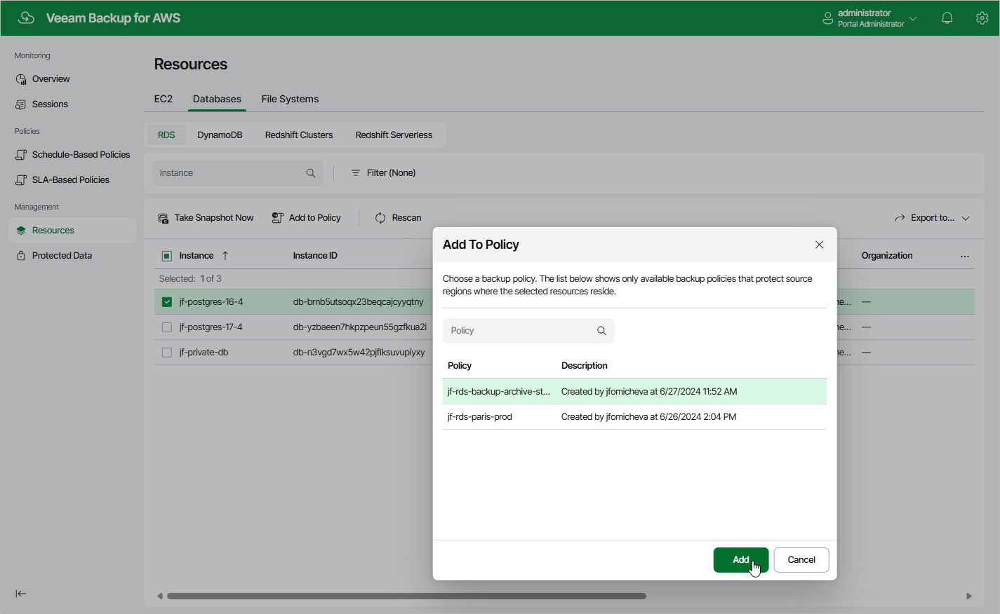

In this article

If you want to protect additional resources by configured backup policies, you can either [edit the backup policy settings](policies_edit.md), or quickly add the resources to the backup policies on the Resources tab.

To add a resource to a backup policy, do the following:

1. Navigate to Resources.
2. Switch to the necessary tab and select the resource that you want to protect by a backup policy.

For a resource to be displayed in the list of available resources, an AWS Region where the resource resides must be specified in any of configured backup policies that protects this kind of resources, and the IAM role specified in the backup policy settings must have permissions to access the resource.

1. Click Add to Policy.
2. In the Add to Policy window:

1. Choose the backup policy that must protect the selected resource and click Add.

For a backup policy to be displayed in the list of available policies, an AWS Region where the selected resource resides must be specified in the policy settings, and the IAM role used by Veeam Backup for AWS for this backup policy must have permissions to access the selected resource.

1. Review the configured settings and click OK.

|  |
| --- |
| Important |
| Veeam Backup for AWS does not support adding AWS Organizations resources to backup policies. |

Page updated 8/20/2025

Page content applies to build 10.0.0.232
