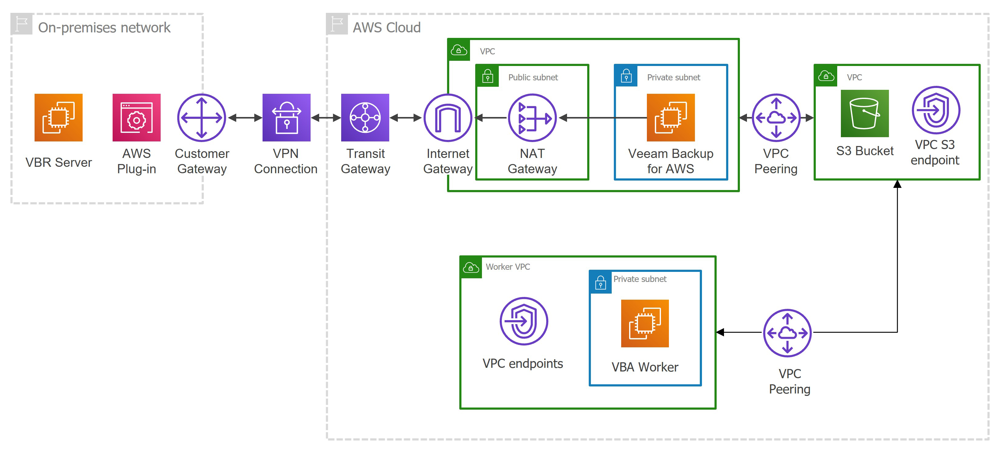

In this article

Starting from Veeam Backup for AWS version 7.0, you can deploy backup appliances in private networks to increase the security of your environment. When a backup appliance is deployed in a private environment, it is not assigned any public IPv4 address, and you will have to perform a number of additional configuration actions to allow private network access.

When deploying a backup appliance [from the Veeam Backup & Replication console](deploying_appliances.md), the only option is to connect it to an existing VPC. In this case, you must allow communication between the Veeam Backup & Replication server and the backup appliance. One possible solution is to establish an AWS Site-to-Site VPN connection between the VPC of the appliance and your on-premises network, as described in [Configuring Access to Backup Appliances in AWS](access_backup_appliances.md).

|  |
| --- |
| Important |
| Even though private deployment of Veeam Backup for AWS ensures private communication between Veeam Backup & Replication servers and backup appliances, the product still uses some public endpoints to interact with AWS services and requires outbound internet access to a number of online repositories. |

For a backup appliance to be able to operate in a private environment, the following requirements must be met:

* To download information on available product updates, the backup appliance requires the following outbound internet access:

| From | To | Protocol | Port |
| --- | --- | --- | --- |
| Backup appliance | Veeam Update Repository (repository.veeam.com) | HTTPS | 443 |
| Ubuntu Security Repository and OS Update repository (security.ubuntu.com, archive.ubuntu.com) | HTTP | 80 |
| Microsoft Package Repository (packages.microsoft.com, dotnetcli.blob.core.windows.net) | HTTPS | 443 |
| PostgreSQL Apt Repository (apt.postgresql.org) | HTTPS | 443 |
| PostgreSQL Website\* (postgresql.org) | HTTPS | 443 |

\*Required to download the repository key <https://www.postgresql.org/media/keys/ACCC4CF8.asc>.

* To perform data protection and disaster recovery operations, the backup appliance must have outbound internet access to the [AWS services](system_requirements_aws_services.md#appliance).
* If you want to receive daily reports and email notifications on backup policy results, outbound internet access must be allowed from the backup appliance to the email service through port 443 over the HTTPS protocol or through the SMTP port specified in the email server settings (port 25 by default).
* If you want to enable single sign-on (SSO) authentication to log in to different software systems with the same credentials using the identity provider service, outbound internet access must be allowed from the user workstation to the identity provider through port 443 over the HTTPS protocol.
* If you want to access the Web UI component from a user workstation, inbound internet access must be allowed from the user workstation to the appliance through port 443 over the HTTPS protocol.
* If the backup appliance is managed by a Veeam Backup & Replication server, inbound internet access must be allowed from the server to the appliance through port 443 over the HTTPS protocol.

Page updated 11/26/2025

Page content applies to build 10.0.0.232
