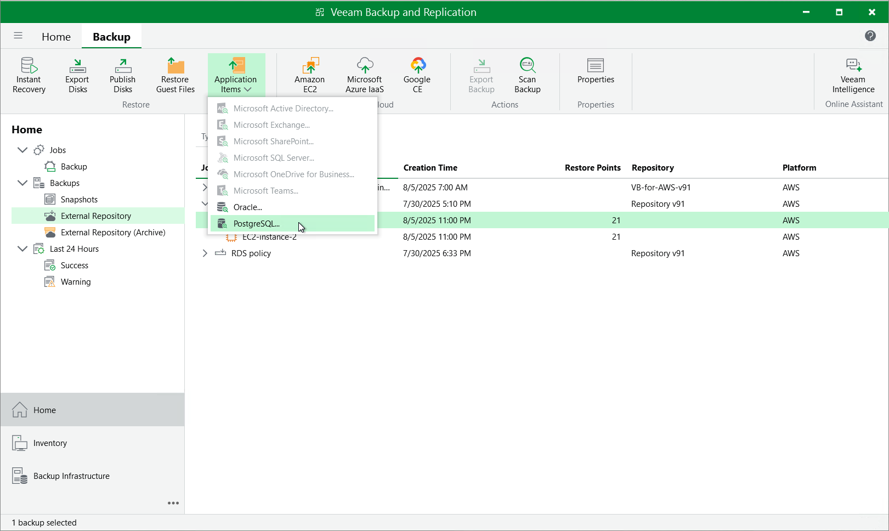

In this article

Veeam Backup & Replication provides auxiliary tools — Veeam Explorers — that allow you to restore application items directly from image-level backups of EC2 instances. You can restore items of the following applications: Microsoft Entra ID, Microsoft Exchange, Microsoft SharePoint, Microsoft SQL Server, Oracle, PostgreSQL and MongoDB. For more information on Veeam Explorers, see the [Veeam Explorers User Guide](https://helpcenter.veeam.com/docs/backup/explorers/explorers_introduction.html?ver=120).

|  |
| --- |
| Important |
| Application restore can be performed only using backup files stored in standard backup repositories for which you have specified access keys of an IAM user whose permissions are used to access the repository. To learn how to specify credentials for repositories, see sections [Editing Backup Repository Settings](repositories_edit.md) and [Connecting to Existing Appliances](connect_appliance_repo.md). |

To perform application restore, do the following:

1. In the Veeam Backup & Replication console, open the Home view.
2. Navigate to Backups > External Repository.
3. Expand the backup policy that protects an EC2 instance whose application item you want to restore, select the necessary instance and click Application Items on the ribbon. Then, select the necessary application.
4. In the restore wizard, select a backup that will be used to restore the application, specify a restore reason and click Browse.
5. In the Veeam Explorer application, perform the steps described in the [Veeam Explorers User Guide](https://helpcenter.veeam.com/docs/vbr/userguide/explorers_introduction.html?ver=13).

|  |
| --- |
| Important |
| The selected backup must be transactionally consistent. To learn how to create transactionally consistent backups, see [Creating EC2 Backup Policies](add_policy_app_aware_processing.md). |

Page updated 11/5/2025

Page content applies to build 10.0.0.232
