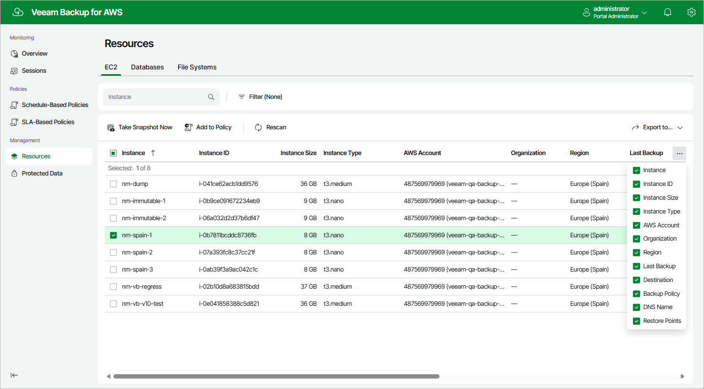

In this article

After you create a backup policy to protect a specific type of AWS resources, Veeam Backup for AWS rescans AWS Regions specified in the policy settings and populates the resource list on the Resources page with all resources of that type residing in these regions. If an AWS Region is no longer specified in any configured backup policy, Veeam Backup for AWS removes all resources residing in the region from the list of available resources.

The Resources page displays AWS resources that can be protected by Veeam Backup for AWS. Each resource is represented with a set of properties, such as:

* Instance, Cluster, Namespace or Name — the name of the resource.
* Instance ID, Table ID, Cluster ID, Namespace ID or File System ID — the unique identification number of the resource.
* Instance Size, Source Size, Cluster Size or Table Size — the size of the resource storage.

|  |
| --- |
| Note |
| Veeam Backup for AWS does not show sizes of Aurora DB clusters due to AWS REST API limitations. |

* AWS Account — the AWS account to which the resource belongs.
* Region — the AWS Region where the resource resides.
* Last Backup — the date and time of the latest restore point created for the resource (if any).
* Backup Policy — the name of the backup policy that protects the resource (if any).
* Restore Points— the number of restore points created for the resource (if any).
* Destination — types of restore points created for the EC2 or RDS resource (if any).

On the Resources page you can also perform the following actions:

* Manually create cloud-native snapshots of RDS and EC2 instances, as well as backups of DynamoDB tables, Redshift clusters, Redshift Serverless, EFS file systems and FSx file systems. For more information, see sections [Creating EC2 Snapshots Manually](snapshot_manual.md), [Creating RDS Snapshots Manually](snapshot_manual_rds.md), [Creating DynamoDB Backups Manually](backup_manual_dynamo.md), [Creating Redshift Backups Manually](backup_manual_redshift.md), [Creating Redshift Serverless Backups Manually](backup_manual_redshift_serverless.md), [Creating EFS Backups Manually](backup_manual_efs.md) and [Creating FSx Backups Manually](backup_manual_fsx.md).
* Add resources to existing backup policies. For more information, see [Adding Resources to Policy](add_to_policy.md).
* Restore entire EC2 instances, EBS volumes attached to EC2 instances, as well as individual files and folders of EC2 instances.

To do that, select an EC2 instance, click the link in the Restore Points column, select the necessary restore point and click Restore > Instance Restore, Volume Restore or File-level Recovery in the Available Restore Points window. Then, complete the wizard as described in section [Performing Entire EC2 Instance Restore](restore_entire_settings.md), [Performing Volume-Level Restore](restore_volume_settings.md) or [Performing File-Level Recovery](restore_item_settings.md).

* Restore entire DB instances, specific DB instance databases and Aurora DB clusters.

To do that, select the RDS resource, click the link in the Restore Points column, select the necessary restore point and click Restore > Instance Restore or Database Restore in the Available Restore Points window. Then, complete the wizard as described in section [Performing RDS Instance Restore](restore_rds_point.md) or [Performing Database Restore](restore_rds_database_point.md).

* Restore DynamoDB tables.

To do that, select the DynamoDB table, click the link in the Restore Points column, select the necessary restore point and click Restore in the Available Restore Points window. Then, complete the wizard as described in section [DynamoDB Restore Using Web UI](restore_point_dynamo.md).

* Restore Redshift clusters.

To do that, select the Redshift cluster, click the link in the Restore Points column, select the necessary restore point and click Restore in the Available Restore Points window. Then, complete the wizard as described in section [Redshift Restore Using Web UI](restore_point_redshift.md).

* Restore Redshift Serverless namespaces.

To do that, select the Serverless namespace, click the link in the Restore Points column, select the necessary restore point and click Restore in the Available Restore Points window. Then, complete the wizard as described in section [Redshift Serverless Restore Using Web UI](redshift_serverless_restore_ui.md).

* Restore entire EFS file systems, as well as individual files and folders stored in file systems.

To do that, select the EFS file system, click the link in the Restore Points column, select the necessary restore point and click Restore > Entire EFS or File-level Recovery in the Available Restore Points window. Then, complete the wizard as described in section [Performing Entire File System Restore](restore_entire_point_efs.md) or [Performing File-Level Recovery](restore_item_type_efs.md).

* Restore FSx file systems.

To do that, select the FSx file system, click the link in the Restore Points column, select the necessary restore point and click Restore in the Available Restore Points window. Then, complete the wizard as described in section [FSx Restore Using Web UI](restore_point_fsx.md).

* Remove all cloud-native snapshots created for EC2 instances, DB instances or Aurora DB clusters manually, as well as remove all backups created for DynamoDB tables, Redshift clusters, EFS file systems and FSx file systems manually.

To do that, select the necessary resource, click the link in the Restore Points column. Then, select the necessary manual snapshot or backup you want to remove in the Available Restore Points window, and click Remove Manual Snapshot or Remove Manual Backup.

* Retrieve archived data from EC2 backups that are stored in repositories of the S3 Glacier Flexible Retrieval or S3 Glacier Deep Archive storage class.

To do that, select the resource, click the link in the Restore Points column, select a restore point that contains the archived data you want to retrieve and click Retrieve Backup in the Available Restore Points window. Then, complete the wizard as described in section [Retrieving EC2 Data From Archive](data_retrieval.md).

To extend time for which you want to keep the retrieved data available for restore operations, select the restore point that contains the retrieved data in the Available Restore Points window, and click Extend Availability. In the Extend Data Availability Period window, specify the number of days for which you want to keep the data available for restore operations, and click Extend.

Page updated 9/22/2025

Page content applies to build 10.0.0.232
