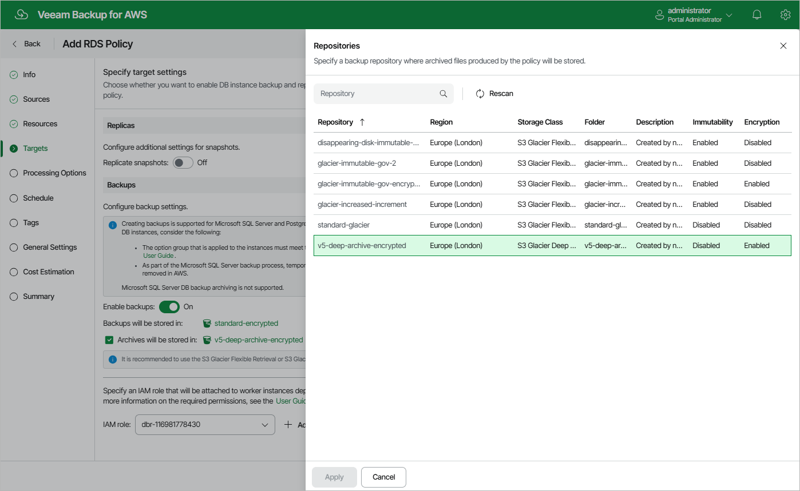
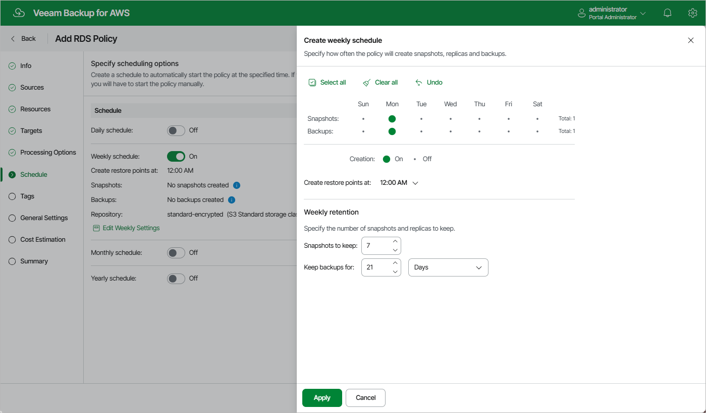
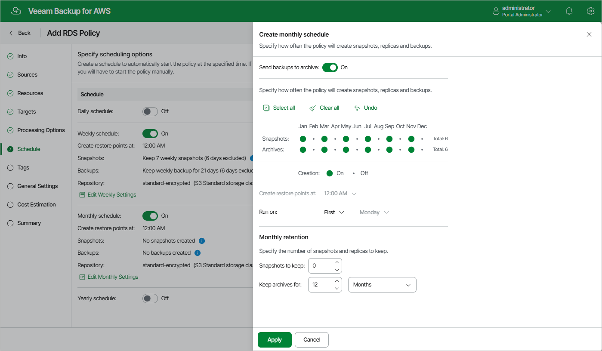
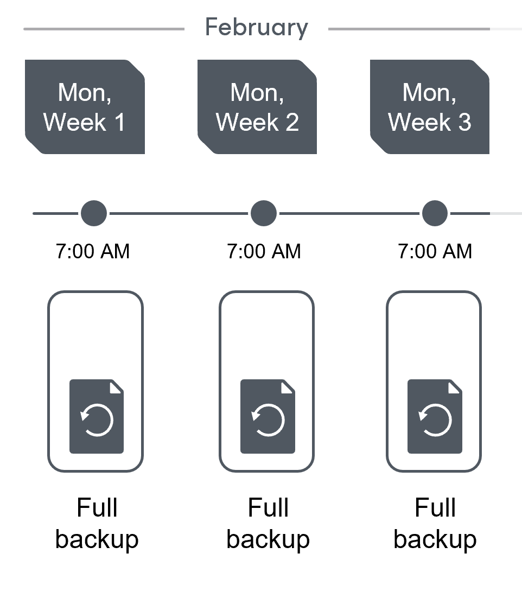
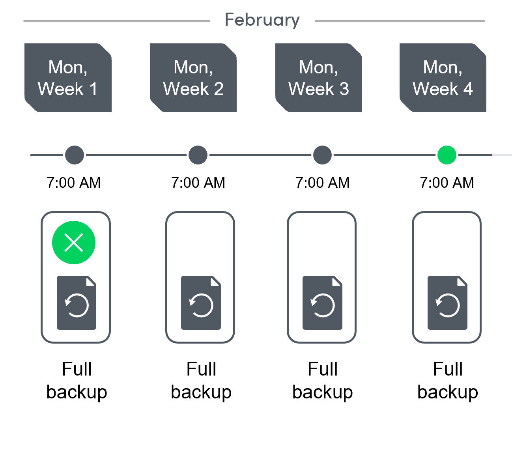
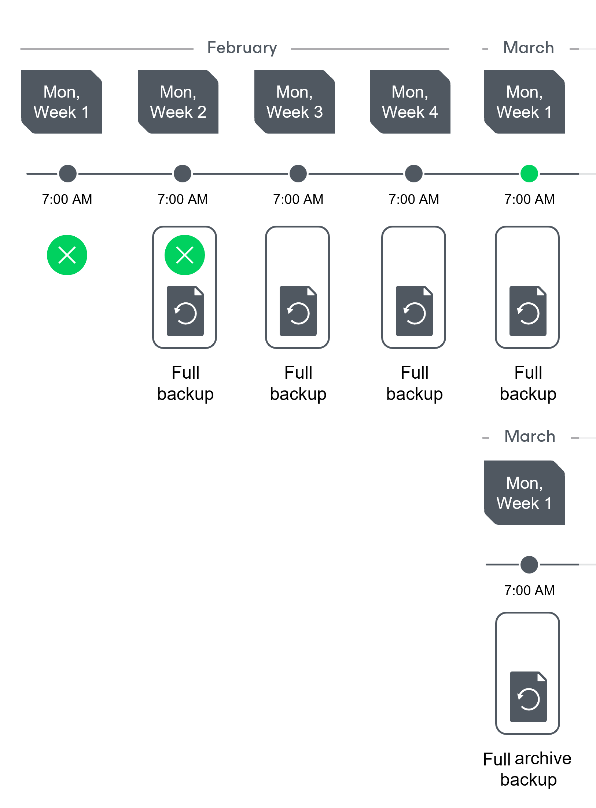
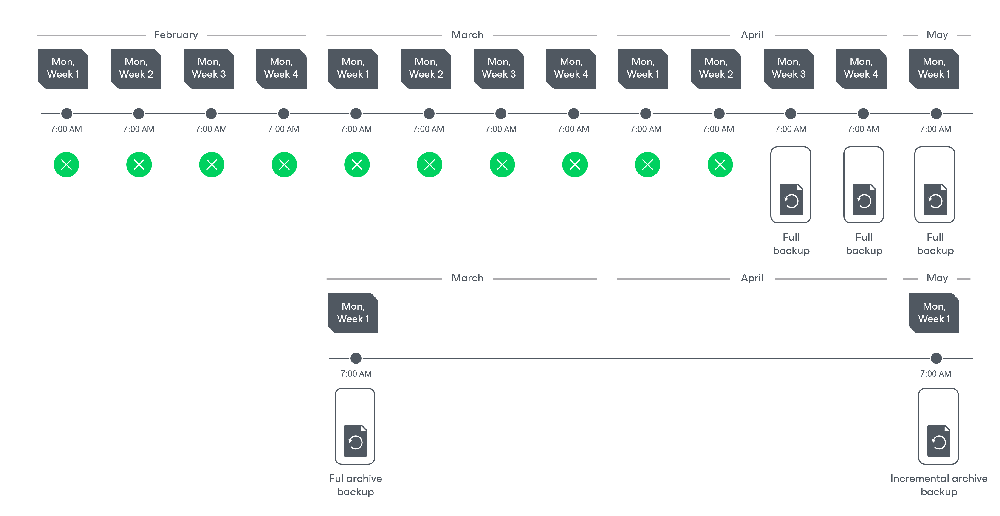
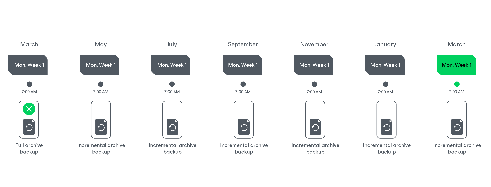

In this article

When you combine multiple types of schedules, you can enable the archiving mechanism to instruct Veeam Backup for AWS to store backed-up data in the secure, low-cost and long-term S3 Glacier Flexible Retrieval and S3 Glacier Deep Archive storage classes. The mechanism is the most useful in the following cases:

* Your data retention policy requires that you keep rarely accessed data in an archive.
* You want to reduce data-at-rest costs and to save space in the high-cost, short-term S3 standard storage class.

|  |
| --- |
| Note |
| Restoring from an archived backup is longer and more expensive than restoring from a regular backup as it is required to retrieve data from the archive repository. For more information, see [Performing Database Restore](data_retrieval_database.md). |

With backup archiving, Veeam Backup for AWS can retain backup files created according to a daily, weekly or monthly schedule for longer periods of time:

* To enable monthly archiving, you must configure a daily or a weekly schedule (or both).
* To enable yearly archiving, you must configure a daily, a weekly or a monthly schedule (or all three).

For Veeam Backup for AWS to use the archiving mechanism, there must be specified at least 2 different schedules: one schedule will control the regular creation of backup files, while another schedule will control the process of copying backup files to an archive backup repository. Backup chains created according to these two schedules will be completely different — for more information, see [RDS Backup Chain](backup_chain_rds.md) and [Archive Backup Chain](archive_chain_rds.md).

Consider the following example. You want a backup policy to create image-level backups of your critical workloads once a week, to keep the backed-up data in a standard backup repository for 3 weeks, and also to keep backups created once in 2 months in an archive backup repository for a year. In this case, you create 2 schedules when configuring the backup policy settings — weekly and monthly:

1. In the policy target settings, you set the Enable backups toggle to On, select a backup repository that will store standard backup files, and select an archive backup repository that will store archived data.

1. In the weekly scheduling settings, you select hours and days when backups will be created (for example, 7:00 AM, Monday), and specify a number of days for which Veeam Backup for AWS will retain backups (for example, 21 days).

Veeam Backup for AWS will propagate these settings to the archive schedule (which is the monthly schedule in our example).

1. In the monthly scheduling settings, you enable the archiving mechanism by setting the Send backups to archive toggle to On, specify when Veeam Backup for AWS will create archive backup files, and choose for how long you want to keep the created backups in the archive backup repository.

For example, January, March, May, July, September, November, 12 months and First Monday.

|  |
| --- |
| Important |
| * When you enable backup archiving, you become no longer able to create a schedule of the same frequency for standard backups. By design, these two functionalities are mutually exclusive.  * If you enable backup archiving, it is recommended that you set the Snapshots to keep value to 0, to reduce unexpected snapshot charges. * If you enable backup archiving, it is recommended that you set the Keep archives for value to at least 3 months (or 90 days) for the S3 Glacier Flexible Retrieval storage class and at least 6 months (or 180 days) for the S3 Glacier Deep Archive storage class. For more information on the minimum storage duration of the Amazon S3 archival storage classes, see [AWS Documentation](https://docs.aws.amazon.com/AmazonS3/latest/userguide/storage-class-intro.html#sc-compare). * If you select the On day option, [harmonized scheduling](harmonized_scheduling_rds.md) cannot be guaranteed. Plus, to support the On day option, Veeam Backup for AWS will require to create an additional temporary restore point if there are no other schedules planned to run on that day. However, the temporary restore point will be removed during the Backup Retention process from AWS in approximately 24 hours, to reduce unexpected infrastructure charges. |

According to the specified scheduling settings, Veeam Backup for AWS will create image-level backups in the following way:

1. On the first Monday of February, a backup session will start at 7:00 AM to create the first restore point in the standard backup chain. Veeam Backup for AWS will store this restore point as a full backup file in the backup repository.
2. On the second and third Mondays of February, Veeam Backup for AWS will create restore points at 7:00 AM and add them to the standard backup chain as a full backup file in the backup repository.

1. On the fourth Monday of February, Veeam Backup for AWS will create a new restore point at 7:00 AM. By the moment the backup session completes, the earliest restore point in the standard backup chain will get older than the specified retention limit. That is why Veeam Backup for AWS will remove from the chain the restore point created on the first Monday.

For more information on how Veeam Backup for AWS transforms standard backup chains, see [RDS Backup Retention](retention_backup_rds.md).

1. On the first Monday of March, a backup session will start at 7:00 AM to create another restore point in the standard backup chain. At the same time, the earliest restore point in the standard backup chain will get older than the specified retention limit again. That is why Veeam Backup for AWS will remove from the chain the restore point created on the second Monday.

After the backup session completes, an archive session will create a restore point with all data from the standard backup chain. Veeam Backup for AWS will copy this restore point as a full archive backup file to the archive backup repository.

1. Up to May, Veeam Backup for AWS will continue adding new restore points to the standard backup chain and deleting outdated backup files from the backup repository, according to the specified weekly scheduling settings.

On the first Monday of May, an archive session will create a restore point. Veeam Backup for AWS will copy this restore point as an incremental archive backup file to the archive backup repository.

1. Up to the first Monday of March of the next year, Veeam Backup for AWS will continue adding new restore points to the standard backup chain and deleting outdated backup files from the backup repository, according to the specified weekly scheduling settings. Veeam Backup for AWS will also continue adding new restore points to the archive backup chain, according to the specified monthly settings.

By the moment the archive session completes, the earliest restore point in the archive backup chain will get older than the specified retention limit. That is why Veeam Backup for AWS remove from the chain the restore point created on the first Monday of March of the previous year.

For more information on how Veeam Backup for AWS transforms archive backup chains, see [Retention Policy for Archived Backups](retention_archive_rds.md).

Page updated 1/6/2026

Page content applies to build 10.0.0.232
