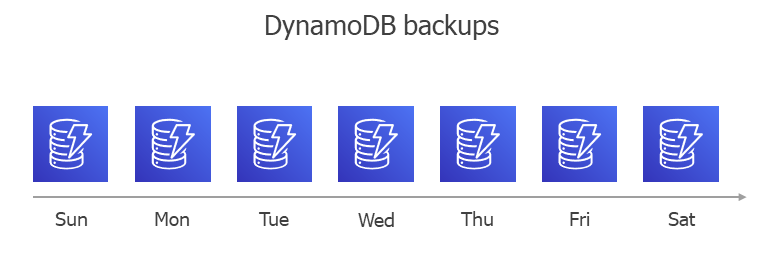

In this article

During every backup session, Veeam Backup for AWS creates a new cloud-native backup for each DynamoDB table added to the backup policy. To create the backup, Veeam Backup for AWS uses the [AWS Backup service](https://docs.aws.amazon.com/aws-backup/latest/devguide/whatisbackup.html). A sequence of cloud-native backups created during a set of backup sessions makes up a backup chain.

Each DynamoDB backup in the backup chain contains encrypted metadata. Metadata stores information about the protected table, the backup policy that created the backup, and the date, time and applied retention settings. Veeam Backup for AWS uses metadata to identify outdated backups, to load the configuration of source tables during recovery operations, and so on.

|  |
| --- |
| Notes |
| * Due to [AWS Backup service limitations](https://docs.aws.amazon.com/aws-backup/latest/devguide/backup-feature-availability.html#features-by-resource), during every backup session, Veeam Backup for AWS creates a full backup in the regular backup chain. * DynamoDB backups created manually are not included into the DynamoDB backup chain. Therefore, these backups are not removed automatically according to retention policy settings. To learn how to remove them, see [Removing DynamoDB Backups Created Manually](backups_remove_individual_dynamo.md). |

DynamoDB backups act as independent restore points for backed-up tables. If you remove any backup, it will not break the DynamoDB backup chain — you will still be able to roll back table data to any existing restore point. The period of time during which DynamoDB backups are kept in the DynamoDB backup chain is defined by retention policy settings. For more information, see [DynamoDB Backup Retention](retention_backup_dynamo.md).

DynamoDB Backup Copy Chain

If you enable backup copying for a backup policy, Veeam Backup for AWS will make a copy of the initially created full DynamoDB backup and save it to the target AWS Region specified in the backup policy settings. In the target AWS Region, backup copies created during a set of backup sessions make up a backup copy chain.

Veeam Backup for AWS creates and maintains a DynamoDB backup copy chain in the same way as a regular DynamoDB backup chain — during every backup copy session Veeam Backup for AWS creates a full backup in the backup copy chain.

Page updated 8/6/2024

Page content applies to build 10.0.0.232
