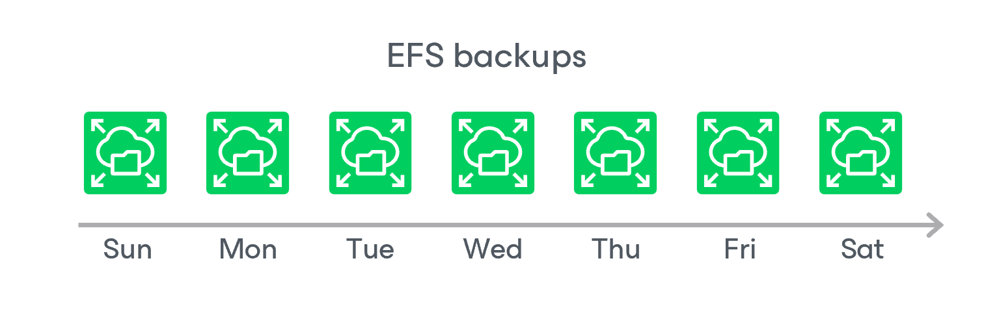

In this article

During every backup session, Veeam Backup for AWS creates a cloud-native backup for each EFS file system added to the backup policy. To create the backup, Veeam Backup for AWS uses the [AWS Backup service](https://docs.aws.amazon.com/aws-backup/latest/devguide/whatisbackup.html).

A sequence of cloud-native backups created during a set of backup sessions makes up a backup chain. Veeam Backup for AWS creates the backup chain in the following way:

1. During the first backup session, Veeam Backup for AWS creates a backup that contains all EFS file system data and saves it in the selected backup vault of the AWS Region where the processed file system resides. This backup becomes a starting point in the backup chain.

The creation of the first backup may take significant time to complete since Veeam Backup for AWS copies the whole image of the EFS file system.

1. During subsequent backup sessions, Veeam Backup for AWS creates backups that contain only those data blocks (files and directories) that have changed since the previous backup session.

The creation of subsequent backups typically takes less time to complete, compared to the first backup in the chain. Note, however, that the completion time still depends on the amount of processed data.

Each EFS backup in the backup chain contains encrypted metadata. Metadata stores information about the protected file system, the backup policy that created the backup, and the date, time and applied retention settings. Veeam Backup for AWS uses metadata to identify outdated backups, to load the configuration of source file systems during recovery operations, and so on.

EFS backups act as independent restore points for backed-up file systems. If you remove any backup, it will not break the EFS backup chain — you will still be able to roll back file system data to any existing restore point. The period of time during which EFS backups are kept in the EFS backup chain is defined by retention policy settings. For more information, see [EFS Backup Retention](retention_backup_efs.md).

|  |
| --- |
| Note |
| EFS backups created manually are not included into the EFS backup chain. Therefore, these backups are not removed automatically according to retention policy settings. For information on how to remove them, see [Removing EFS Backups Created Manually](backups_remove_individual_efs.md). |

EFS Backup Copy Chain

If you enable backup copying for a backup policy, Veeam Backup for AWS will make a copy of the initially created EFS backup and save it to the target AWS Region specified in the backup policy settings. In the target AWS Region, backup copies created during a set of backup sessions make up a backup copy chain.

Veeam Backup for AWS creates and maintains an EFS backup copy chain in the same way as a regular EFS backup chain:

* The first created backup copy of the processed file system becomes a starting point in the backup copy chain.
* Backup copies created during subsequent backup sessions store only those data blocks that have changed since the previous backup session.

EFS Indexing Chain

If you enable EFS indexing for a backup policy, Veeam Backup for AWS during each indexing session creates and index of the processed file system and associates the index with one or multiple restore points as described in section [EFS Backup](backup_hiw_efs.md#index). In the target backup repository, EFS indexes created during a set of indexing sessions make up an indexing chain.

EFS indexes always contain full file catalogs of the processed file system. Therefore, if you delete any index from the backup repository, the index chain will not be corrupted but you may not be able to restore file and folders to a restore point associated with the deleted index using the file-level recovery browser. To learn how to perform file-level recovery, see [Performing File-Level Restore](restore_item_perform_efs.md).

The period of time during which EFS indexes are kept in the indexing chain is defined by time stamps that were saved in the index metadata when creating the indexes. For more information, see [EFS Backup Retention](retention_backup_efs.md).

Page updated 5/21/2025

Page content applies to build 10.0.0.232
