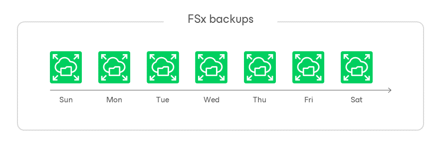

In this article

During every backup session, Veeam Backup for AWS creates a cloud-native backup for each FSx file system added to the backup policy. To create the backup, Veeam Backup for AWS uses the [AWS Backup service](https://docs.aws.amazon.com/aws-backup/latest/devguide/whatisbackup.html).

A sequence of cloud-native backups created during a set of backup sessions makes up a backup chain. Veeam Backup for AWS creates the backup chain in the following way:

1. During the first backup session, Veeam Backup for AWS creates a backup that contains all FSx file system data and saves it in the selected backup vault of the AWS Region where the processed file system resides. This backup becomes a starting point in the backup chain.

The creation of the first backup may take significant time to complete since Veeam Backup for AWS copies the whole image of the FSx file system.

1. During subsequent backup sessions, Veeam Backup for AWS creates backups that contain only those data blocks (files and directories) that have changed since the previous backup session.

The creation of subsequent backups typically takes less time to complete, compared to the first backup in the chain. Note, however, that the completion time still depends on the amount of processed data.

Each FSx backup in the backup chain contains encrypted metadata. Metadata stores information about the protected file system, the backup policy that created the backup, and the date, time and applied retention settings. Veeam Backup for AWS uses metadata to identify outdated backups, to load the configuration of source file systems during recovery operations, and so on.

FSx backups act as independent restore points for backed-up file systems. If you remove any backup, it will not break the FSx backup chain — you will still be able to roll back file system data to any existing restore point. The period of time during which FSx backups are kept in the FSx backup chain is defined by retention policy settings. For more information, see [FSx Backup Retention](retention_backup_fsx.md).

|  |
| --- |
| Note |
| FSx backups created manually are not included into the FSx backup chain. Therefore, these backups are not removed automatically according to retention policy settings. For information on how to remove them, see [Removing FSx Backups Created Manually](backups_remove_individual_fsx.md). |

FSx Backup Copy Chain

If you enable backup copying for a backup policy, Veeam Backup for AWS will make a copy of the initially created FSx backup and save it to the target AWS Region specified in the backup policy settings. In the target AWS Region, backup copies created during a set of backup sessions make up a backup copy chain.

Veeam Backup for AWS creates and maintains a FSx backup copy chain in the same way as a regular FSx backup chain:

* The first created backup copy of the processed file system becomes a starting point in the backup copy chain.
* Backup copies created during subsequent backup sessions store only those data blocks that have changed since the previous backup session.

Page updated 8/6/2024

Page content applies to build 10.0.0.232
