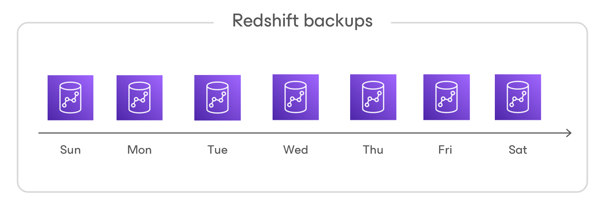

In this article

During every backup session, Veeam Backup for AWS creates a new cloud-native backup for each Redshift Serverless namespace added to the backup policy. To create the backup, Veeam Backup for AWS uses the [Amazon Redshift Serverless service](https://docs.aws.amazon.com/redshift/latest/mgmt/serverless-snapshots-recovery-points.html). A sequence of cloud-native backups created during a set of backup sessions makes up a backup chain.

Each Redshift Serverless backup in the backup chain contains encrypted metadata. Metadata stores information about the protected namespace and its associated workgroup, the backup policy that created the backup, and the date, time and applied retention settings. Veeam Backup for AWS uses metadata to identify outdated backups, to load the configuration of source namespace during recovery operations, and so on.

|  |
| --- |
| Notes |
| Redshift Serverless backups created manually are not included into the Redshift Serverless backup chain. Therefore, these backups are not removed automatically according to retention policy settings. To learn how to remove them, see [Removing Redshift Serverless Backups Created Manually](backups_remove_individual_redshift_serverless.md). |

Redshift Serverless backups act as independent restore points for backed-up namespaces. If you remove any backup, it will not break the Redshift Serverless backup chain — you will still be able to roll back namespace data to any existing restore point. The period of time during which Redshift Serverless backups are kept in the Redshift Serverless backup chain is defined by retention policy settings. For more information, see [Redshift Serverless Backup Retention](retention_backup_redshift_serverless.md).

Page updated 12/12/2024

Page content applies to build 10.0.0.232
