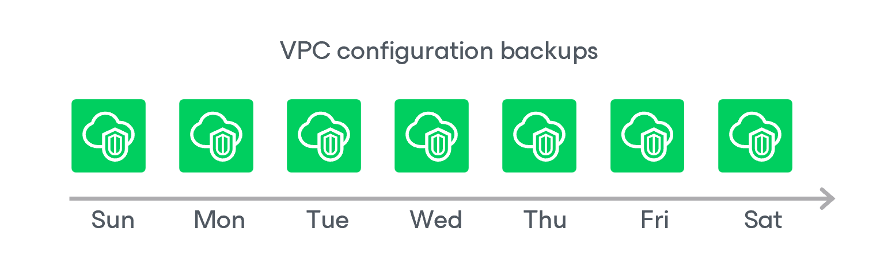

In this article

During every backup session, Veeam Backup for AWS creates a restore point with backed-up VPC configuration data for each AWS Region protected by the VPC Configuration Backup policy. The restore point contains encrypted metadata that includes information on the date and time when the policy ran, AWS Regions whose VPC configuration settings were backed up by the policy, and AWS accounts whose IAM roles were used to collect VPC configuration settings for each AWS Region.

A sequence of restore points created during a set of backup sessions makes up a VPC configuration backup chain for each configuration record.

You cannot delete specific restore points created for a configuration record — these points are removed automatically according to the specified [retention policy settings](vpc_policy_retention.md). However, you can manually remove a configuration record with all restore points created for it, as described in section [Removing VPC Configuration Backups](backups_remove_vpc.md).

Related Topics

[VPC Configuration Backup Retention](retention_backup_vpc.md)

Page updated 5/21/2025

Page content applies to build 10.0.0.232
