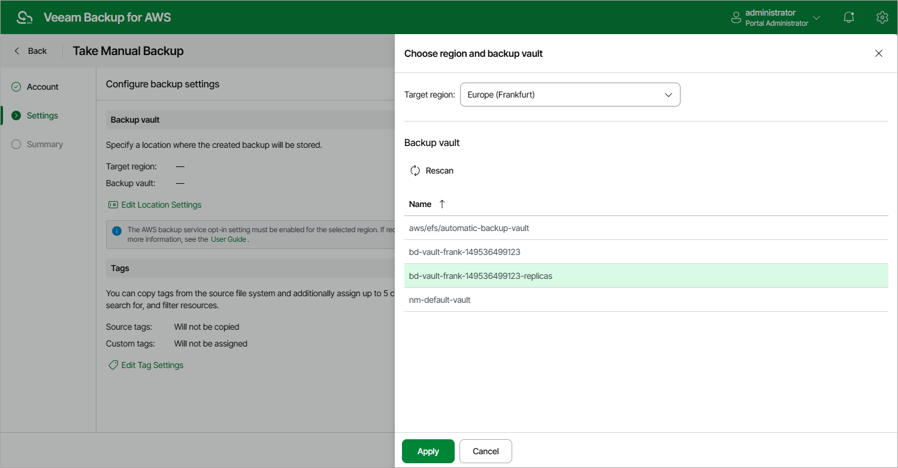

In this article

Veeam Backup for AWS allows you to manually create backups of Amazon EFS file systems. You can instruct Veeam Backup for AWS to store the created backups in the same AWS Regions where the processed file systems reside, or in a different AWS Region.

|  |
| --- |
| Note |
| Veeam Backup for AWS does not include EFS backups created manually in the EFS backup chain and does not apply the configured retention policy settings to these backups. This means that the backups are kept in your AWS environment unless you remove them manually, as described in section [Managing Backed-Up EFS Data](backups_view_efs.md). |

To manually create a backup of an EFS file system, do the following:

1. Navigate to Resources > File Systems > EFS.

|  |
| --- |
| Note |
| By default, Veeam Backup for AWS uses an AWS CloudTrail trail to track changes in your EFS resources. If no trails are configured in the source AWS account, Veeam Backup for AWS will access AWS resources and populate the list of available file systems or AWS tags only once in 24 hours. To force the data collection process manually, click Rescan. |

1. Select the necessary file system and click Take Backup Now.

For an EFS file system to be displayed in the list of available file systems, an AWS Region where the file system resides must be added to any of [configured EFS backup policies](add_policy_source_settings_efs.md), and the IAM role specified in the backup policy settings or in the organization settings must have permissions to access the file system. For more information on the required permissions, see [EFS Backup IAM Role Permissions](role_permissions_backup_efs.md).

1. Complete the Take Manual Backup wizard:

1. At the Account step of the wizard, specify an IAM role whose permissions Veeam Backup for AWS will use to create the backup. The specified IAM role must belong to the same AWS account to which the processed EFS file systems reside.

For an IAM role to be displayed in the list of available roles, it must be added to Veeam Backup for AWS as described in section [Adding IAM Roles](iam_roles_add.md).

|  |
| --- |
| Important |
| Veeam Backup for AWS does not support taking manual snapshot using IAM roles specified in the [organization settings](organization_add_settings.md). |

1. In the Backup vault section of the Settings step of the wizard, click Edit Location Settings.

In the Choose region and backup vault window, specify the following settings:

1. From the Target region drop-down list, select an AWS Region where manual backups will be stored.
2. In the Backup vault section, select a backup vault that will be used to store file system backups.

For a backup vault to be displayed in the list of available vaults, it must be created in the AWS Backup console as described in [AWS Documentation](https://docs.aws.amazon.com/aws-backup/latest/devguide/create-a-vault.html#creating-a-vault-console). If you have not created a backup vault for the selected AWS Region, Veeam Backup for AWS will display only the default backup vault created for the AWS Region automatically.

1. To save changes made to the location settings, click Apply.

|  |
| --- |
| Important |
| * Veeam Backup for AWS does not support storing backups in [logically air-gapped vaults](https://docs.aws.amazon.com/aws-backup/latest/devguide/logicallyairgappedvault.html) and in backup vaults with the [AWS Backup Vault Lock](https://docs.aws.amazon.com/aws-backup/latest/devguide/vault-lock.html) feature enabled.  * Make sure policies assigned to the selected backup vault allow Veeam Backup for AWS to access vault resources and to perform backup, backup copy and restore operations. For more information on vault access policies, see [AWS Documentation](https://docs.aws.amazon.com/aws-backup/latest/devguide/create-a-vault-access-policy.html). |

1. At the Tags section of the Settings step of the wizard, if you want to assign tags to the created backup, click Edit Tag Settings.

In the Tag configuration window, specify tag settings:

1. To assign already existing AWS tags from the processed file system, select the Copy tags from source file system check box.

If you choose to copy tags from source file system, Veeam Backup for AWS will first create a backup of the EFS file system and assign to the created backup AWS tags with Veeam metadata, then Veeam Backup for AWS will copy tags from the processed file system and, finally, assign the copied AWS tags to the backup.

1. To assign your own custom AWS tags, set the Add custom tags to created backup toggle to On and specify the tags explicitly. To do that, use the Key and Value fields to specify a key and a value for the new custom AWS tag, and then click Add. Note that you cannot add more than 5 custom AWS tags.

If you choose to add custom tags to created backups, Veeam Backup for AWS will assign the specified tags right after it creates a backup.

1. To save changes made to the tag settings, click Apply.

1. At the Summary step of the wizard, review configuration information, choose whether you want to proceed to the [Session Log page](reporting.md#ui) to track the progress of snapshot creation, and click Finish.

Page updated 9/26/2025

Page content applies to build 10.0.0.232
