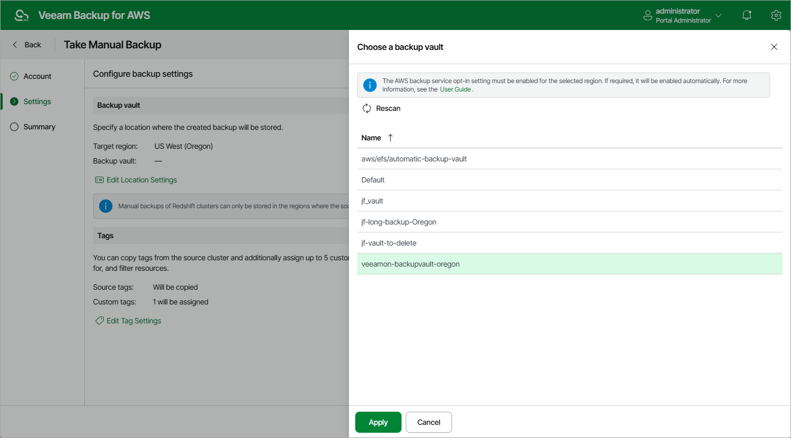

In this article

Veeam Backup for AWS allows you to manually create backups of Redshift clusters. You can instruct Veeam Backup for AWS to store the created backups only in the same AWS Regions where the processed Redshift clusters reside.

|  |
| --- |
| Note |
| Veeam Backup for AWS does not include backups created manually in the backup chain and does not apply the configured retention policy settings to these backups. This means that the backups are kept in your AWS environment unless you remove them manually, as described in section [Managing Backed-Up Redshift Data](backups_view_redshift.md). |

To manually create a backup of a Redshift cluster, do the following:

1. Navigate to Resources > Databases > Redshift.
2. Select the necessary cluster and click Take Backup Now.

For a Redshift cluster to be displayed in the list of available clusters, an AWS Region where the cluster resides must be added to any of [configured Redshift backup policies](add_policy_source_settings_redshift.md), and the IAM role specified in the backup policy settings or in the organization settings must have permissions to access the cluster. For more information on the required permissions, see [Redshift Backup IAM Role Permissions](role_permissions_backup_redshift.md).

1. Complete the Take Manual Backup wizard:

1. At the Account step of the wizard, specify an IAM role whose permissions Veeam Backup for AWS will use to create the backup. The specified IAM role must belong to the same AWS account to which the processed Redshift clusters reside.

For an IAM role to be displayed in the list of available roles, it must be added to Veeam Backup for AWS as described in section [Adding IAM Roles](iam_roles_add.md).

|  |
| --- |
| Important |
| Veeam Backup for AWS does not support taking manual backup using IAM roles specified in the [organization settings](organization_add_settings.md). |

1. In the Backup vault section of the Settings step of the wizard, click Edit Location Settings.

In the Choose a backup vault window, select a backup vault that will be used to store cluster backups. For a backup vault to be displayed in the list of available vaults, it must be created in the AWS Backup console as described in [AWS Documentation](https://docs.aws.amazon.com/aws-backup/latest/devguide/create-a-vault.html#creating-a-vault-console).

Note that since [cross-region copying of Redshift backups](https://docs.aws.amazon.com/aws-backup/latest/devguide/backup-feature-availability.html#features-by-resource) is not supported by the AWS Backup service, the list of available vaults will include only those backup vaults that exist in the AWS Region where the selected source cluster resides.

|  |
| --- |
| Important |
| * Veeam Backup for AWS does not support storing backups in [logically air-gapped vaults](https://docs.aws.amazon.com/aws-backup/latest/devguide/logicallyairgappedvault.html) and in backup vaults with the [AWS Backup Vault Lock](https://docs.aws.amazon.com/aws-backup/latest/devguide/vault-lock.html) feature enabled.  * Make sure policies assigned to the selected backup vault allow Veeam Backup for AWS to access vault resources and to perform backup and restore operations. For more information on vault access policies, see [AWS Documentation](https://docs.aws.amazon.com/aws-backup/latest/devguide/create-a-vault-access-policy.html).  * For Veeam Backup for AWS to be able to back up Redshift clusters, you must enable the Opt-in service for the Redshift resource type in the AWS Backup settings. Otherwise, Veeam Backup for AWS will automatically enable the service for the AWS Region specified in the backup settings in your AWS account while performing backup operations. |

1. At the Tags section of the Settings step of the wizard, to assign tags to the created backup, click Edit Tag Settings.

In the Tag configuration window, specify tag settings:

1. To assign already existing AWS tags from the processed cluster, select the Copy tags from source cluster check box.

If you choose to copy tags from the source cluster, Veeam Backup for AWS will first create a backup of the Redshift cluster and assign to the created backup AWS tags with Veeam metadata, then Veeam Backup for AWS will copy tags from the processed cluster and, finally, assign the copied AWS tags to the backup.

1. To assign your own custom AWS tags, set the Add custom tags to created backup toggle to On and specify the tags explicitly. To do that, use the Key and Value fields to specify a key and a value for the new custom AWS tag, and then click Add. Note that you cannot add more than 5 custom AWS tags.

If you choose to add custom tags to the created backups, Veeam Backup for AWS will assign the specified tags right after it creates a backup.

1. To save changes made to the tag settings, click Apply.

1. At the Summary step of the wizard, review configuration information, choose whether you want to proceed to the [Session Log page](reporting.md#ui) to track the progress of backup creation, and click Finish.

Page updated 9/23/2025

Page content applies to build 10.0.0.232
